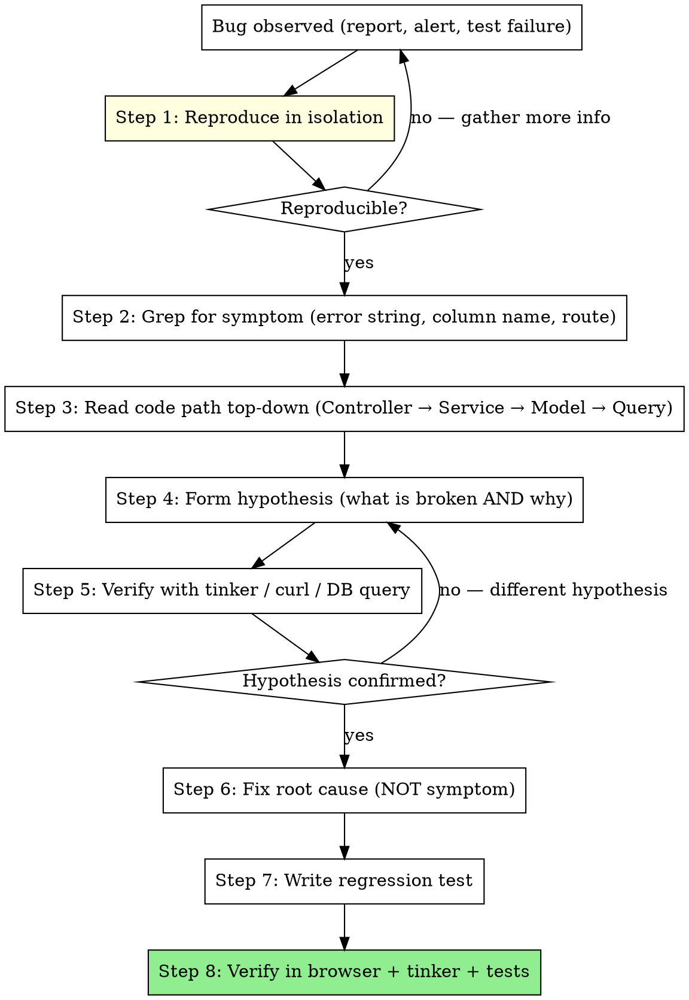

# Laravel Debugging Toolkit

You are debugging a Laravel SaaS. **The single most common debugging failure is patching symptoms not causes** — adding a `try/catch` to silence an error, "fixing" by reloading, or guessing what the user did. This skill captures the disciplined toolkit that finds root causes fast.

**Origin:** A Laravel 12 SaaS with 1100+ tests where debugging skill compounded: month 1 = "let me change this and see", month 12 = "tinker, grep, hypothesize, verify, patch, regression test". The difference is process, not tools. Tools amplify the process.

**Companion skills**: `saas-testing-dual-layer` has the verify-don't-assume flowchart in test context. This skill is the broader toolkit + Laravel-specific patterns.

## When to use this skill

ALWAYS when:
- Reproducing a bug report
- Diagnosing a failed test
- "It worked yesterday" investigations
- Performance regression (slow page, slow query)
- Job didn't run / didn't retry / silently failed
- Cron didn't fire at the expected time
- Email didn't deliver
- Production exception that didn't happen locally
- User reports something that "shouldn't be possible"

NEVER:
- Skip straight to a fix without reproducing
- Add a try/catch just to make the error stop appearing
- "Restart and see if it goes away" without understanding why
- Push a "should fix it" change without verifying

## The disciplined workflow



**The shortcut you must NOT take**: skipping step 5 (verify). "I think it's because X" → patch X. If X wasn't the cause, you've added complexity AND the bug is still there.

## The 4 layers of debugging tools

### Layer 1: Inline (fastest, dev-only)

| Tool | Use case | Note |
|---|---|---|
| `dd($var)` | Stop & dump | Use sparingly. NEVER commit. |
| `dump($var)` | Dump & continue | Same, NEVER commit. |
| `ddd($var)` | Dump in Laravel Debugbar style | Requires Debugbar installed. |
| `ray($var)` | Send to Spatie Ray desktop app | Needs Ray.app + `spatie/laravel-ray`. |
| `info($var)` | Log to `laravel.log` | Survives committed code (with discretion). |
| `dump_request()` (custom helper) | Pretty-print current Request | Helper you should write once. |

**The discipline**: `dd()` is for exploration, not commit. Set up a pre-commit hook that fails if `dd(` or `ddd(` appears in staged PHP files.

### Layer 2: Logs (always available, prod-safe)

```php
// config/logging.php — multi-channel routing
'channels' => [
    'stack' => ['driver' => 'stack', 'channels' => ['daily', 'slack_alerts']],
    'daily' => ['driver' => 'daily', 'path' => storage_path('logs/laravel.log'), 'days' => 14],
    'billing' => ['driver' => 'daily', 'path' => storage_path('logs/billing/billing.log'), 'days' => 1825],
    'kitchen' => ['driver' => 'daily', 'path' => storage_path('logs/kitchen/kitchen.log'), 'days' => 14],
    'mail' => ['driver' => 'daily', 'path' => storage_path('logs/mail/mail.log'), 'days' => 30],
    'slack_alerts' => ['driver' => 'slack', 'url' => env('LOG_SLACK_WEBHOOK_URL'), 'level' => 'critical'],
],
```

Usage:
```php
Log::info('order_created', ['order_id' => $order->id, 'tenant_id' => $order->tenant_id]);
Log::channel('billing')->warning('charge_failed', ['code' => $err]);
Log::channel('slack_alerts')->critical('payment gateway down', ['provider' => 'wompi']);
```

**Doctrine**: structured logging with context (arrays), never `Log::info("Order {$order->id} created")`. Structured logs are greppable and machine-parsable.

### Layer 3: Inspectors (dev-only, sometimes staging)

| Tool | Best for | Install | Prod-safe? |
|---|---|---|---|
| **Laravel Debugbar** (`barryvdh/laravel-debugbar`) | Query inspector, route info, memory, performance per-request | dev only | NO — leak risk |
| **Laravel Telescope** (`laravel/telescope`) | Request history, exceptions, queries, jobs, mail, notifications, schedule | dev + staging | NO in prod without gate |
| **Laravel Pulse** (`laravel/pulse`) — **NEW in Laravel 11** | Performance dashboard, slow queries, slow jobs, server health, application metrics | dev + staging + **prod** | YES — designed for prod |
| **Spatie Ray** (`spatie/laravel-ray`) | Desktop app for dd-style debugging across team | dev only | NO |
| **Tinker** (`php artisan tinker`) | Interactive REPL | always | YES (carefully) |

**Pulse is the new game-changer**: lightweight prod monitoring. Slow query detection, slow job detection, exception count, cache hit rate. Configure threshold per workspace.

```php
// config/pulse.php
'recorders' => [
    \Laravel\Pulse\Recorders\SlowQueries::class => [
        'threshold' => 1000,  // log queries slower than 1s
        'ignore' => ['/^select \* from `telescope_entries`/'],
    ],
    \Laravel\Pulse\Recorders\SlowJobs::class => [
        'threshold' => 10000,  // 10s
    ],
    \Laravel\Pulse\Recorders\Exceptions::class => [],
    \Laravel\Pulse\Recorders\UserRequests::class => [],
],
```

### Layer 4: Distributed tracing (prod, paid)

- **Sentry** — exception tracking + performance traces + breadcrumbs
- **Bugsnag** — alternative to Sentry, similar feature set
- **Datadog APM** — heavyweight, enterprise

**Doctrine**: every exception in prod goes to Sentry with `tenant_id` + `user_id` + `correlation_id` as tags. When a user reports "something broke", you search Sentry by their `tenant_id` and find the exception in seconds.

## Tinker — the secret weapon

```bash
# Interactive REPL
php artisan tinker

# One-shot command (great for CI and scripted debugging)
php artisan tinker --execute="echo App\Models\User::count();"

# With Sail
./vendor/bin/sail artisan tinker --execute="..."
```

### Tinker recipes (memorize these)

```php
// Read a model
User::find(42)
User::where('email', 'x@y.com')->first()

// Check a scope
Order::paid()->count()

// Test a relation
$user = User::find(42); $user->orders->count();

// Verify a multi-tenant scope behavior
app()->instance('current_tenant', Tenant::find(5));
Order::count();  // should show only Tenant 5's orders

// Bypass global scope to see all
Order::withoutGlobalScopes()->count();

// Manually trigger a job (synchronously)
\App\Jobs\GenerateInvoicePdf::dispatchSync($invoice);

// Manually trigger a scheduled command
\Artisan::call('billing:retry-dunning');

// Inspect a model's casts/fillable
$o = new Order; dump($o->getCasts(), $o->getFillable());

// Check raw DB column type
DB::select('SHOW COLUMNS FROM printer_settings LIKE "width_mm"');

// Verify queue worker config
\Queue::size('kitchen')

// Read an exception's full trace
try { $service->doThing(); } catch (\Throwable $e) { dd($e->getMessage(), $e->getFile() . ':' . $e->getLine(), $e->getTraceAsString()); }
```

**Doctrine from POSLatam memory**: "Verify, don't assume." Tinker + grep are your hypothesis-validation tools. Never patch without verifying the hypothesis in tinker first.

## Laravel Pail — live log tailing (NEW in Laravel 11)

`php artisan pail` replaces `tail -f storage/logs/laravel.log` with a far better tool: color-coded, filterable, structured.

```bash
# Stream all logs
php artisan pail

# Filter by level
php artisan pail --level=error

# Filter by user
php artisan pail --user=42

# Filter by message content
php artisan pail --message='charge_failed'

# Filter by file
php artisan pail --filter='SubscriptionController'

# Truncate verbose logs
php artisan pail --timeout=0
```

**Replaces** `tail -f storage/logs/laravel.log | grep ...` workflows. Works with any log channel.

## `Model::preventLazyLoading()` — N+1 detector

Add to `AppServiceProvider::boot()`:

```php
public function boot(): void
{
    Model::shouldBeStrict(! app()->isProduction());  // dev/staging only
}
```

Or more granular:
```php
Model::preventLazyLoading(! app()->isProduction());
Model::preventSilentlyDiscardingAttributes(! app()->isProduction());
Model::preventAccessingMissingAttributes(! app()->isProduction());
```

What it does in dev:
- `preventLazyLoading()`: throws `LazyLoadingViolationException` when you call `$user->orders` without `with('orders')` prior. Forces eager loading discipline.
- `preventSilentlyDiscardingAttributes()`: throws when you `update(['field_not_in_fillable' => ...])`. Catches typos.
- `preventAccessingMissingAttributes()`: throws when you `$model->non_existent_column`. Catches dead refs after migrations.

**Doctrine**: turn ALL THREE on in dev/staging. They surface bugs at dev-time that would silently corrupt prod data.

## Query debugging

### `toSql()` / `toRawSql()`

```php
$query = Order::where('status', 'paid')->where('tenant_id', 5);

$query->toSql();
// "select * from `orders` where `status` = ? and `tenant_id` = ?"

$query->toRawSql();
// "select * from `orders` where `status` = 'paid' and `tenant_id` = 5"
```

`toRawSql()` is what you paste into MySQL Workbench or `mysql` CLI for direct inspection.

### Query log (one-shot)

```php
DB::enableQueryLog();
// run your code
$queries = DB::getQueryLog();
dd($queries);  // array of all queries + bindings + time
```

In tests:
```php
$this->beginDatabaseTransaction();
DB::enableQueryLog();
$this->get('/dashboard');
$queries = DB::getQueryLog();
$this->assertLessThan(20, count($queries), 'Dashboard should not N+1');
```

### N+1 detection in tests

```php
public function test_orders_index_does_not_n_plus_one(): void
{
    Order::factory()->count(20)->create();

    DB::enableQueryLog();
    $this->actingAs($this->owner)->get('/orders');
    $queries = DB::getQueryLog();

    // Allow 10 base queries + 1 for orders + 2 for relations = 13ish
    $this->assertLessThan(15, count($queries),
        'Orders index should eager-load, found ' . count($queries) . ' queries');
}
```

### Slow query logging (MySQL config)

```ini
# my.cnf
slow_query_log = 1
slow_query_log_file = /var/log/mysql/slow.log
long_query_time = 0.5  # seconds
log_queries_not_using_indexes = 1
```

Then `tail -f /var/log/mysql/slow.log` shows queries > 500ms. Pulse covers this in-app.

## Queue / Job debugging

### See pending and failed

```bash
# How many jobs in each queue?
php artisan queue:size kitchen
php artisan queue:size mail
php artisan queue:size default

# Show failed jobs
php artisan queue:failed

# Retry a specific failed job
php artisan queue:retry 42

# Retry all failed
php artisan queue:retry all

# Delete a failed job
php artisan queue:forget 42

# Clear ALL failed
php artisan queue:flush
```

### Run one job synchronously (debug)

```bash
# Process ONE job from the queue, blocking
php artisan queue:work --once --queue=kitchen

# With verbose output
php artisan queue:work --once --queue=kitchen -vvv
```

### `queue:listen` vs `queue:work`

- `queue:listen` — restarts the framework between jobs. **No `tries` / retry support**. USE ONLY for local dev observing rapid code changes.
- `queue:work` — long-running worker. Supports `--tries`, `--backoff`, `--timeout`. **USE IN PRODUCTION.**

**Common bug**: deploying with `queue:listen` in supervisor config → jobs never retry. Use `queue:work`.

### "My job isn't running" cookbook

1. Is a worker process running? `ps aux | grep queue:work`
2. Is the worker watching the correct queue? Check supervisor config: `--queue=kitchen,mail,default`. If your job dispatches to `kitchen` but worker only watches `default` → silent.
3. Is the job class autoloaded? `composer dump-autoload`
4. Is the job throwing on construct? Check `queue:failed` — the job appears here.
5. Is the connection right? `QUEUE_CONNECTION=database` vs `redis` in `.env`.
6. Is there a code bug after dispatch? Tail `storage/logs/laravel.log` while dispatching.

## Cron / Scheduler debugging

### List scheduled tasks

```bash
php artisan schedule:list

# Output:
#  0 2 * * *  php artisan billing:process-recurring-charges  Next due: 2026-05-16 02:00:00
#  0 3 * * *  php artisan billing:retry-dunning              Next due: 2026-05-16 03:00:00
#  ...
```

### Test a scheduled task without waiting for cron

```bash
# Interactive: pick which to run
php artisan schedule:test

# Or run a specific command
php artisan billing:retry-dunning --dry-run
```

### Capture scheduler output

```php
// app/Console/Kernel.php
$schedule->command('billing:reconcile-subscriptions')
    ->dailyAt('07:00')
    ->appendOutputTo(storage_path('logs/scheduler/reconcile.log'))
    ->emailOutputOnFailure(config('app.ops_email'));
```

### "My cron didn't run" cookbook

1. Is `cron` itself running on the server? `service cron status`
2. Is Laravel's scheduler triggered every minute? `crontab -e` should have `* * * * * cd /path/to/app && php artisan schedule:run >> /dev/null 2>&1`
3. Is the timezone correct? `config/app.php` `'timezone' => ...` AND `date_default_timezone_get()` in PHP CLI.
4. Is the task in the schedule? `php artisan schedule:list`
5. Did the task throw silently? `->appendOutputTo(...)` log file has stderr.
6. PHP-CLI vs PHP-FPM env diff? `php -i | grep date.timezone` (CLI) vs `phpinfo()` in browser.

## Mail debugging

### Local dev — log driver writes to laravel.log

```ini
MAIL_MAILER=log
```

```bash
tail -f storage/logs/laravel.log
# Or with Pail:
php artisan pail --filter=mail
```

### Mailtrap for visual inspection

```ini
MAIL_MAILER=smtp
MAIL_HOST=sandbox.smtp.mailtrap.io
MAIL_PORT=2525
MAIL_USERNAME=...
```

Mailtrap shows the rendered HTML, source, headers, spam score.

### Test sending

```php
// In Tinker
Mail::raw('Test', fn($m) => $m->to('you@example.com')->subject('Smoke'));
```

Or the dedicated command (from `laravel-saas-email-transactional` skill):
```bash
php artisan mail:smoke you@example.com --tenant=demo
```

### "My email didn't deliver" cookbook

1. Is `MAIL_MAILER` set correctly? `config:clear` if you just changed `.env`.
2. Is the API key valid? Try a curl to the provider's API.
3. Is the recipient suppressed? Check `email_suppressions` table.
4. Is DNS configured (SPF/DKIM/DMARC)? `mxtoolbox.com`.
5. Is the bounce webhook handling marking them suppressed automatically? Check Resend dashboard.
6. Did the queue process the mailable? `queue:failed` and `queue:size mail`.

## Exception handling

### `app/Exceptions/Handler.php` (Laravel < 11) or `bootstrap/app.php` (Laravel 11+)

```php
// Laravel 11+ — bootstrap/app.php
->withExceptions(function (Exceptions $exceptions) {
    $exceptions->dontReport([
        // Don't send to Sentry/Bugsnag
        \Illuminate\Auth\AuthenticationException::class,
        \Illuminate\Validation\ValidationException::class,
    ]);

    $exceptions->render(function (DomainException $e, $request) {
        // Custom rendering for domain exceptions
        if ($request->wantsJson()) {
            return response()->json(['error' => $e->getMessage()], 422);
        }
        return back()->with('error', $e->getMessage());
    });

    $exceptions->report(function (\Throwable $e) {
        \Sentry\Laravel\Integration::captureUnhandledException($e);
    });
})
```

### Custom domain exceptions

```php
namespace App\Exceptions;

abstract class DomainException extends \Exception {}

final class InvalidOrderTransitionException extends DomainException {}
final class InsufficientStockException extends DomainException {}
final class PaymentDeclinedException extends DomainException {}
```

**Doctrine**: catch `DomainException` at the controller layer with a user-friendly response. Let `\Throwable` (real bugs) bubble to the Handler → Sentry.

## Production debugging (carefully)

### Tail production logs

```bash
# SSH to prod, then
tail -f storage/logs/laravel.log

# Or per channel
tail -f storage/logs/billing/billing-$(date +%Y-%m-%d).log

# With grep filter
tail -f storage/logs/laravel.log | grep tenant_id=42

# Better — install Pail in prod too
php artisan pail --level=error
```

### Sentry breadcrumbs + context

```php
// AppServiceProvider boot()
\Sentry\configureScope(function (Scope $scope): void {
    if ($user = auth()->user()) {
        $scope->setUser([
            'id' => $user->id,
            'email' => $user->email,
            'tenant_id' => app('current_tenant')?->id,
        ]);
        $scope->setTag('tenant_slug', app('current_tenant')?->slug);
    }
});

// Add custom breadcrumb at significant boundary
\Sentry\addBreadcrumb(new \Sentry\Breadcrumb(
    \Sentry\Breadcrumb::LEVEL_INFO,
    \Sentry\Breadcrumb::TYPE_DEFAULT,
    'subscription.state_changed',
    ['from' => 'active', 'to' => 'past_due'],
));
```

### Correlation IDs

Generate at middleware entry, attach to logs + Sentry + outgoing HTTP:

```php
class CorrelationIdMiddleware
{
    public function handle(Request $request, Closure $next): Response
    {
        $id = $request->header('X-Correlation-Id') ?? (string) Str::uuid();
        $request->headers->set('X-Correlation-Id', $id);
        \Log::shareContext(['correlation_id' => $id]);
        \Sentry\configureScope(fn($scope) => $scope->setTag('correlation_id', $id));
        $response = $next($request);
        $response->headers->set('X-Correlation-Id', $id);
        return $response;
    }
}
```

When a user reports a bug, ask for the X-Correlation-Id from response headers → grep logs by it → see the entire request lifecycle.

### Maintenance mode for emergency debugging

```bash
# Take site down for everyone except your IP
php artisan down --secret="my-debug-key" --refresh=15

# Visit /my-debug-key once to get past the maintenance page
# Now you have the live app to yourself

# When done
php artisan up
```

## Performance debugging

### Find the slow endpoint

1. Open Pulse `/pulse` dashboard
2. Look at "Slow Requests" — endpoints sorted by p95
3. Click the endpoint → see slow queries, slow jobs, exceptions in that endpoint
4. Cross-reference with Telescope for a specific request to see the query plan

### N+1 detection in dev

With `Model::preventLazyLoading()` enabled (see above), any lazy load throws. Tests fail fast. In browser, dev users see the exception page.

### Memory leak in a Job

```php
public function handle(): void
{
    $startMem = memory_get_usage();

    foreach ($this->largeIterable as $item) {
        $this->processItem($item);

        if (memory_get_usage() - $startMem > 50 * 1024 * 1024) {  // 50 MB
            \Log::warning('memory_leak_suspected', [
                'job' => static::class,
                'mb_used' => round((memory_get_usage() - $startMem) / 1024 / 1024, 2),
            ]);
        }
    }
}
```

### Slow query plan

```php
DB::statement("EXPLAIN " . $query->toRawSql());
// Look for "Using filesort", "Using temporary", "type=ALL" — all bad signs
```

Common fixes: add an index, eager load, narrow the WHERE, paginate.

## The cookbook — common recipes

### "My migration fails"

```bash
php artisan migrate:status
# Check the current state — which migrations ran?

php artisan migrate --pretend
# Show SQL without executing — eyeball the ALTER statements

# If a migration broke prod mid-way:
# 1. Restore DB from backup
# 2. Fix the migration
# 3. Test on a copy of prod
# 4. Re-run

# NEVER: php artisan migrate:fresh in prod (DESTRUCTIVE)
```

### "My change doesn't appear in the browser"

1. Did you save the file? (laughs, but yes — check the timestamp)
2. Is Vite running? `ls public/hot` should exist.
3. Did you clear config cache? `php artisan config:clear`
4. Did you clear view cache? `php artisan view:clear`
5. Hard reload browser (Cmd/Ctrl+Shift+R).
6. Are you on the right branch? `git branch --show-current`
7. Did the migration run? `php artisan migrate:status`

### "Tests pass locally, fail in CI"

1. Env diff: dump `php -i` and compare. Common: timezone, locale.
2. DB diff: SQLite in CI vs MySQL local? Check `phpunit.xml`.
3. Time-sensitive tests: use `Carbon::setTestNow()`.
4. Order-sensitive: use `--random` locally to catch.
5. Filesystem case sensitivity: macOS forgives, Linux doesn't. Check imports.
6. Missing seed: CI might run `migrate:fresh` without seeding.

### "User reports error I can't reproduce"

1. Search Sentry by their `user_id` or `tenant_id` tag.
2. Get the exact URL, time, user agent from Sentry.
3. Impersonate them (if you have super_admin impersonation) and replay.
4. Read the breadcrumbs from Sentry to see the state preceding the error.
5. Check the audit log table for that tenant in the 5 minutes around the error.

### "My job dispatches but doesn't run"

See "queue debugging" section above. 90% of the time: worker doesn't watch the right queue, OR `queue:listen` was used instead of `queue:work`.

### "My cron worked yesterday, not today"

1. `crontab -e` — is the entry still there? Server reboot can lose user crons.
2. `php artisan schedule:list` — is the task scheduled?
3. Disk full? `df -h` — full disk silently breaks lots of things.
4. PHP version changed (server upgrade)? `php -v` — your code might need a different version.
5. `.env` change without `config:cache` refresh.

## Anti-patterns — never do this

- `dd()` in committed code (use pre-commit hook to block)
- `try { } catch (\Throwable $e) { }` (empty catch — silently buries bugs)
- Adding `try/catch` "to fix it" without understanding what was thrown
- Logging entire request body (PII leak, possibly tokens)
- Telescope in production without an auth gate (massive PII exposure)
- `dump()` in API responses (breaks JSON)
- Mocking the thing you're testing (e.g. mocking the Service in a Service test)
- `var_dump()` instead of `dd()` (var_dump doesn't stop execution)
- `error_log()` instead of `Log::*()` (loses Laravel context)
- Debugging in prod by adding `Log::info()` everywhere then deploying (use Pulse + Sentry for prod observability)
- "It works on my machine" without running the exact same Sail / Docker version
- Patching a symptom: "user can't login" → "let me bypass the auth check" (NEVER — find root cause)
- Killing the queue worker to "reset" — investigate why it's stuck first

## Setup checklist for new SaaS

- [ ] Install Laravel Pail: `composer require laravel/pail --dev` (included since Laravel 11)
- [ ] Install Laravel Pulse: `composer require laravel/pulse` (run in prod for monitoring)
- [ ] Install Telescope (dev/staging only): `composer require laravel/telescope --dev`
- [ ] Install Debugbar (dev only): `composer require barryvdh/laravel-debugbar --dev`
- [ ] Enable `Model::shouldBeStrict()` in `AppServiceProvider::boot()` for non-prod
- [ ] Set up Sentry: `composer require sentry/sentry-laravel` + `SENTRY_LARAVEL_DSN` env
- [ ] CorrelationIdMiddleware registered globally
- [ ] Multi-channel logging configured (`daily`, `billing`, `kitchen`, `mail`, `slack_alerts`)
- [ ] Slow query logging in MySQL (`long_query_time = 0.5`)
- [ ] Pre-commit hook blocks `dd(` and `dump(` in PHP files
- [ ] CI step: grep for `dd(` and fail if present in `app/` or `tests/`
- [ ] `php artisan mail:smoke` command (see `laravel-saas-email-transactional`)
- [ ] Custom domain exceptions defined: `app/Exceptions/*Exception.php`
- [ ] Handler renders `DomainException` user-friendly, lets `\Throwable` bubble to Sentry

## Cross-references

- `saas-testing-dual-layer` — the "verify-don't-assume" debug workflow in test context
- `laravel-saas-billing-infrastructure` — log channel `billing` + Sentry thresholds for payment failures
- `laravel-saas-email-transactional` — log channel `mail` + `mail:smoke` command + Resend webhook debugging
- `laravel-saas-architecture-decisions` — when pro-grade logging applies (PCI-grade: sanitize, never log body)
- `senior-dev-code-style` — don't catch what you don't handle (relates to anti-patterns above)
- `laravel-design-patterns-toolkit` — Jobs `failed()` hook for terminal failures + Sentry alert
