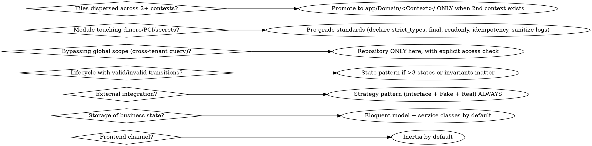
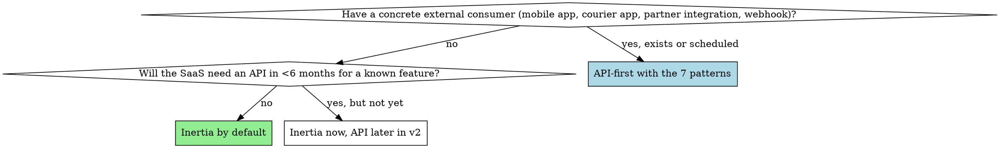

# Laravel SaaS Architecture Decisions

You are guiding **when** to use each architectural pattern in a Laravel SaaS. The wrong default is to apply enterprise patterns everywhere "because they're best practice" — that creates 3× the code, 2× the bugs, and 5× the onboarding cost. The right default is to **start simple and earn complexity**.

**Origin:** Distilled from a Laravel 12 + Vue 3 + Inertia SaaS that shipped a Wompi billing module (PCI-grade), a multi-tenant + multi-location data layer (14 retrofit phases), and a delivery API endpoint with the 7 API-first patterns. The scars include: (a) wanting to refactor every controller to DDD bounded contexts before shipping anything; (b) considering API-first when only Inertia was needed; (c) tempted to apply `declare(strict_types=1)` + `final` + `readonly` to every file. **All three would have killed the project.**

## When to use this skill

Invoke this skill BEFORE:
- Starting any new feature larger than 1 endpoint
- Deciding "should this be an API or an Inertia page"
- Deciding "should this be a Repository or just `Model::query()`"
- Deciding "should this be a State machine or just a column"
- Wondering if `app/Domain/<Context>/` deserves its own folder yet
- Adding any external integration (payment gateway, OAuth, webhook receiver)
- Touching anything that stores money, tokens, secrets, or PII

## The 7 architectural decisions (with defaults)



## Decision 1: Inertia vs API

**Default: Inertia.** You are a solo dev or small team building a SaaS for B2B users that mostly access via web browser. Inertia gives you SPA UX with monolith dev speed. The decision is reversed only when:



**Do NOT refactor internal modules to API just because "it's cleaner" — you'll triple the code and gain nothing.**

### The 7 API-first patterns (only apply when you DO need an API)

When an endpoint has an actual external consumer, apply ALL 7. Skipping any creates a maintenance liability later.

1. **URL versioning** — `routes/api.php` under `v1/` prefix. NEVER ship `/api/something` unversioned.
2. **Auth with Sanctum + abilities** — tokens carry scopes (`delivery:read`, `inventory:write`). Not just `auth:sanctum`.
3. **Rate limiting per plan** — `ApiRateLimitByPlan` middleware. Bucket key is tenant_id, limit derived from `$tenant->activeSubscription()->plan->slug`.
4. **DTOs obligatorios** — Spatie laravel-data or Eloquent Resources. **NEVER expose Eloquent directly** (`return $model` is a no).
5. **Response envelope** — `{ data, meta }` on success, `{ error: { code, message, details? } }` on error. Apply via `ApiResponseEnvelope` middleware. **The middleware attaches `meta` even when a Resource already wraps with `data`.**
6. **Idempotency-Key obligatorio on mutations** — POST/PUT/PATCH/DELETE that create or modify state. Query endpoints (no side-effects) are exempt. Middleware `RequireIdempotencyKey` enforces the header.
7. **Contract in markdown** — one file per endpoint in `docs/api/v1/<resource>.md`. Generate OpenAPI auto-spec only when you have 3-4 endpoints; before that the markdown is more readable.

These 7 are non-negotiable for a public endpoint. There is no "I'll add idempotency later" — adding it after launch breaks consumers.

## Decision 2: Repository pattern — almost never use it

**Default: don't use Repository.** Eloquent already IS the repository. Wrapping `Model::find($id)` in `Repository::find($id)` adds zero value and removes IDE introspection.

**The one valid use case**: when you need `withoutGlobalScopes()` to query cross-tenant (e.g. super_admin reports, billing reconciliation, audit jobs). In that case, the Repository name signals "I am bypassing tenant scope on purpose — read the access check inside."

```php
final class SubscriptionRepository
{
    /**
     * Cross-tenant query — bypasses BelongsToTenant global scope.
     * Used by SuspendOverdueSubscriptionsCommand which iterates all tenants.
     * Access check: command runs only via scheduler (no HTTP), no user context needed.
     */
    public function allOverdue(): Collection
    {
        return Subscription::withoutGlobalScopes()
            ->where('status', SubscriptionStatus::PastDue)
            ->where('next_billing_at', '<', now())
            ->get();
    }
}
```

If you find yourself writing a Repository because "the controller is getting fat", **extract a Service class instead**, not a Repository. Services hold orchestration logic; Repositories hold (only) bypass queries.

## Decision 3: State pattern — only when invariants matter

**Default: just use a column with an enum.** A `status` column on the model with a PHP 8.1+ backed enum is enough for 80% of cases.

**Promote to State pattern when**:
- More than 3 states AND there are invalid transitions you must reject at runtime
- Each state has different allowed operations (e.g. "cancelled" subscription cannot be charged, "trial" can be upgraded but not refunded)
- An audit trail of state changes is required (compliance, billing)

Example: a Subscription with 9 states (`trial`, `active`, `past_due`, `paused`, `cancelled`, `expired`, `suspended`, `soft_deleted`, `hard_deleted`) and ~25 valid transitions out of the possible 81 — that needs State pattern. A SaleReturn with 3 states (`pending`, `approved`, `rejected`) does not.

```php
abstract class SubscriptionState
{
    abstract public function canCharge(): bool;
    abstract public function canCancel(): bool;
    abstract public function transitionTo(self $newState): self;

    final public function name(): string
    {
        return SubscriptionStatus::from(static::class)->value;
    }
}

final class ActiveState extends SubscriptionState
{
    public function canCharge(): bool { return true; }
    public function canCancel(): bool { return true; }

    public function transitionTo(SubscriptionState $newState): SubscriptionState
    {
        return match (true) {
            $newState instanceof PastDueState => $newState,
            $newState instanceof PausedState => $newState,
            $newState instanceof CancelledState => $newState,
            default => throw new InvalidTransitionException(
                "active → {$newState->name()} not allowed"
            ),
        };
    }
}
```

## Decision 4: Strategy pattern — ALWAYS for external integrations

**Every** external integration (payment gateway, OAuth provider, SMS provider, email provider, OCR service, geocoding API) must use Strategy pattern: **interface + Fake + Real implementation**.

```php
interface PaymentGatewayInterface
{
    public function charge(ChargeData $data): ChargeResult;
    public function refund(string $transactionId, int $amount): RefundResult;
    public function tokenize(CardData $card): TokenResult;
}

final class WompiGateway implements PaymentGatewayInterface { /* real HTTP calls */ }
final class StripeGateway implements PaymentGatewayInterface { /* real HTTP calls */ }
final class FakeGateway implements PaymentGatewayInterface { /* force flags for tests */ }
```

**Why ALWAYS, not "when you need 2nd provider"**: because the day you need a 2nd provider, you also need to migrate live transactions, and refactoring the gateway under load is the worst time. Pay the small upfront cost.

**The Fake implementation has `force*` flags** to simulate failures in tests:
```php
final class FakeGateway implements PaymentGatewayInterface
{
    public bool $forceChargeFailure = false;
    public bool $forceTimeout = false;
    public ?string $forceErrorCode = null;

    public function charge(ChargeData $data): ChargeResult
    {
        if ($this->forceTimeout) throw new ConnectionException();
        if ($this->forceChargeFailure) return ChargeResult::failed($this->forceErrorCode ?? 'declined');
        return ChargeResult::succeeded('fake_tx_' . uniqid());
    }
}
```

## Decision 5: Pro-grade standards — surgical, not blanket

**This is the most-violated rule.** PHP/Laravel content sells "always declare strict types, always final, always readonly DTOs" as universal best practice. **It is not.** Applied everywhere, you triple boilerplate and confuse new contributors. Apply ONLY where there is real risk that the discipline pays back:

### Modules that DO require pro-grade standards

- Payment gateways (Wompi, Stripe, Mercadopago, etc.)
- Subscription state management (anything that charges money)
- Repository classes that bypass global scopes
- Webhook receivers (HMAC validation, idempotency)
- OAuth callbacks (token exchange, refresh)
- Anything that persists PAN/CVV/tokens/api secrets/passwords
- Audit log writers

### Modules that do NOT require pro-grade standards

- CRUD admin pages (Categories, Tags, Customers)
- Public storefront / catalog views
- Settings tabs
- POS UI flows
- Inventory adjustments
- Reports / dashboards
- Email templates
- Image upload / file management

### The pro-grade checklist (apply to qualifying modules ONLY)

**1. Type safety**
- `declare(strict_types=1);` at top of every file
- `final class` by default (justify opening to inheritance with a comment)
- `readonly` properties on Value Objects and DTOs
- Type hints on every parameter and return (PHP 8.2+ strict)
- Typed enums for status/role/method — zero magic strings

**2. Security (PCI / PII)**
- `#[\SensitiveParameter]` on every parameter receiving PAN, CVV, token, client_secret, api_secret, webhook_secret, password, OAuth bearer. Including parameters that receive DTOs with sensitive fields inside.
- `__debugInfo()` on DTOs that hold sensitive data — `#[\SensitiveParameter]` does NOT protect return values or local vars, but `__debugInfo()` does (respected by `dd()`, `var_dump()`, Sentry, Bugsnag, VarDumper)
- Eloquent `'encrypted'` cast on token columns
- `$hidden` on models so `toArray()` / `toJson()` / Inertia shares cannot accidentally serialize tokens
- Helper `logException($e, $correlationId)` that logs **only** `error_class`, `error_message`, `correlation_id`. **NEVER** request body, response body, full DTO. A response body containing a token leaked via Telescope is a real incident waiting to happen.
- Exceptions sanitized: `throw new Exception($response->body())` is a security bug if the body contains a token. Use only status code + correlation id hint.

**3. Reliability**
- **Idempotency keys** on every money operation (charge, refund, tokenize, subscribe). UNIQUE constraint in DB is the source of truth — not in-memory cache.
- **Circuit Breaker** in HTTP calls to external gateway. **Separate keys per call type** — `gateway:auth` vs `gateway:api` — so a broken auth endpoint doesn't take down the charge endpoint.
- **Retry with backoff** on transient errors (5xx, timeouts) but NEVER on 4xx (you'd be retrying a known-bad request).

**4. Audit**
- Domain events emitted on every state change (`SubscriptionStarted`, `PaymentCharged`, `RefundIssued`, `SubscriptionCancelled`)
- Audit log table is **append-only** (no `update`, no `delete`)
- Each row stores `correlation_id` that ties together: HTTP request → service call → gateway call → webhook → notification

**5. Tests obligatory**
- Unit: every State (valid + invalid transitions), every DTO factory, every helper
- Feature: full flow with FakeGateway or `Http::fake()`
- Security: cross-tenant isolation (min 10 scenarios — see `saas-testing-dual-layer`)
- PCI smoke: reflection that verifies `#[\SensitiveParameter]` is on every sensitive param. Smoke test that throws an exception and asserts the secret does NOT appear in `getTrace()` / `__toString()` / `var_export()` / `serialize()` / `print_r()`. `Log::shouldReceive('error')` to verify body never reaches the logger even when HTTP call fails.

### Operational doc obligatory

For every pro-grade module, ship `docs/security/<MODULE>_LOGGING_NOTES.md` listing the third-party tools that could leak sensitive data and how they are configured: Telescope (disabled in prod), Sentry (data scrubbing rules), web server access logs (no body capture), error pages (generic), bugsnag (PII filters).

## Decision 6: DDD bounded contexts — lazy

**Default: keep everything in `app/Modules/<Feature>/` or `app/Http/Controllers/`.** Promote to `app/Domain/<Context>/` **only** when you start the **second** bounded context.

A bounded context is a piece of business logic that:
- Has its own ubiquitous language (terms that mean something specific to that domain)
- Has its own lifecycle / state machine independent of the core CRUD
- Communicates with the rest of the app via events or explicit interfaces, not via shared models

First bounded context: usually billing or a complex integration (delivery routing, OCR pipeline, payments). Second: another one. **Until you have two, don't fold the first into `app/Domain/` — keep it in `app/Services/<Feature>/`.**

When you DO promote:
```
app/Domain/
  Billing/
    States/
    Events/
    DTOs/
    Repositories/   # only for cross-tenant queries
    Gateways/       # strategy: interface + Fake + Real
    Services/
  Delivery/
    Providers/      # geocoding, routing strategy
    DTOs/
    Services/
```

## Decision 7: When the "should I be doing it RIGHT now" loop fires

You are tempted to refactor while shipping a feature. STOP. The question is:

1. **Will this refactor break the feature I'm shipping?** If no → do it (small).
2. **Is the current pattern actively painful (bugs, performance, security)?** If yes → file the refactor as a separate ticket, don't bundle.
3. **Am I refactoring because the new pattern is "cleaner"?** Then NO. Ship the feature. The cleaner pattern can wait.

You will fall in love with patterns. The discipline is to NOT apply them when the cost is real and the benefit is theoretical.

## Anti-patterns — never do this

- Refactoring the entire codebase to use `declare(strict_types=1)` because you read a tweet
- Wrapping every Eloquent model in a Repository "for testability" — your tests work fine with `RefreshDatabase`
- Splitting a 200-line controller into 8 actions because "controllers should be thin" — 200 lines that flow top-to-bottom is fine
- Using `final` on a model that gets `factory()` extended in tests (breaks `extends Factory`)
- Throwing `$response->body()` into an exception message
- Caching gateway responses in Redis without scrubbing the token first
- Logging the entire `$request->all()` in a catch block
- Putting `$guarded = []` on any model that has `tenant_id`
- Trying to add Idempotency-Key middleware "later" after the API is live

## Cross-references

- `laravel-saas-multi-tenant-foundation` — the data layer this all sits on
- `laravel-saas-auth-granularity` — Owner vs Manager scope rules
- `laravel-saas-settings-architecture` — per-tenant + per-branch override pattern
- `saas-testing-dual-layer` — PHPUnit + Playwright workflow
- `saas-plan-gating-billing` — pro-grade billing module reference
- `vue-inertia-frontend-system` — the frontend side of the Inertia choice
