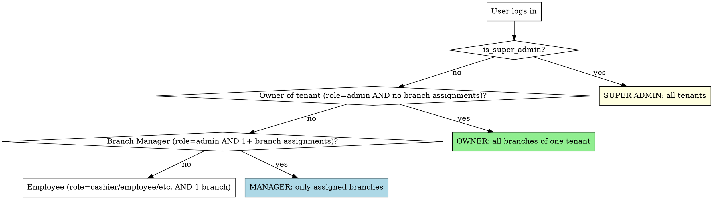

# Laravel SaaS Auth Granularity — Owner vs Branch Manager

You are designing auth for a multi-tenant SaaS where the **role column is NOT enough** to express what a user can do. Two users with `role = admin` can have completely different scopes depending on whether they have branch assignments.

**Origin:** A Laravel SaaS where the initial RBAC (`admin / cashier / chef`) was insufficient when the SaaS went multi-location. We had to add a second axis (`branch_user` pivot) and a doctrine for what Owner can do vs Branch Manager. The retrofit took 8 PRs (Phase 13b/c/e). **Doing this from day 1 is 1/10th the work.**

## When to use this skill

Activate this skill when:
- You are about to write a Policy class
- You are about to add a button/menu item to the sidebar
- You are exposing a new endpoint that touches tenant-wide data (reports, billing, branch list)
- You are reviewing whether a Manager can escalate by URL manipulation
- You are designing the signup → invite team member → assign to branch flow
- You are unsure if a feature is Owner-only or Manager-allowed

## The 4 user archetypes

Forget the `role` column for a moment. The real question is **what scope does the user have**:



| Archetype | Created how | Sees | Can mutate |
|---|---|---|---|
| Super Admin | `users.is_super_admin = true` | All tenants | Anything (impersonate any tenant) |
| Owner | Signup creator. `tenant_user.role = admin`, NO `branch_user` rows | All branches of their tenant | Anything in their tenant |
| Branch Manager | Owner invites + assigns. `tenant_user.role = admin` AND `branch_user` rows | Only their assigned branches | Only their assigned branches |
| Employee | Manager or Owner invites + assigns. `tenant_user.role = cashier/etc.`, `branch_user` 1 row | Their branch | Their branch (limited by RBAC role) |

## The User helper methods

These four methods on the `User` model are the auth contract. Memorize their semantics.

```php
public function isOwner(?int $tenantId = null): bool
{
    if ($this->is_super_admin) {
        return false; // super_admin is SaaS operator, not tenant owner
    }
    return $this->tenantRole($tenantId) === 'admin'
        && empty($this->assignedBranchIds($tenantId));
}

public function isBranchManager(?int $tenantId = null): bool
{
    return $this->tenantRole($tenantId) === 'admin'
        && ! empty($this->assignedBranchIds($tenantId));
}

public function canSeeAllBranches(?int $tenantId = null): bool
{
    return $this->is_super_admin || $this->isOwner($tenantId);
}

public function canManageBranch(int $branchId, ?int $tenantId = null): bool
{
    if ($this->canSeeAllBranches($tenantId)) {
        return true;
    }
    return in_array($branchId, $this->assignedBranchIds($tenantId), true);
}
```

**`canSeeAllBranches()` is the most-used gate.** It encapsulates "Owner OR super_admin". Use it everywhere you'd otherwise write `$user->isOwner() || $user->is_super_admin`.

## The Owner-only operations matrix

Anything in this matrix should be **gated behind `canSeeAllBranches()`** at the Policy AND Controller level, AND hidden in UI for Managers.

| Operation | Why Owner-only |
|---|---|
| Create / delete branches | Tenant-wide schema change |
| Touch billing (upgrade plan, change card, cancel) | Financial authority |
| Invite / promote other admins | Anti-escalation: a Manager should not be able to create a peer Owner |
| Tenant-wide config (currency, country, fiscal id, business name) | Affects all branches |
| Cross-branch reports / aggregations | Manager should see only their slice |
| Export tenant data (CSV, backup) | PII + cross-branch leak risk |
| Revert per-branch settings overrides to default | Settings authority (see `laravel-saas-settings-architecture`) |
| View / change subscription | Billing surface |
| Add payment gateway credentials | Secret management |

Everything **NOT in this matrix** is Manager-allowed within their assigned branches.

## The auth bypass trap (subtle but real)

`canSeeAllBranches(null)` returns true for `is_super_admin = true` — that's intentional. **But** if `$tenantId` ends up null in a controller because middleware misfired, a super_admin could bypass tenant scope.

**Always guard with**:
```php
$tenantId = app()->bound('current_tenant') ? (int) app('current_tenant')->id : null;
abort_unless($user && $tenantId !== null && $user->canSeeAllBranches($tenantId), 403);
```

The order is critical: `$tenantId !== null` first, then the gate.

## Policies — the canonical pattern

Every business resource gets a Policy that follows this 3-tier check:

```php
final class OrderPolicy
{
    /**
     * Super admin always allowed (for SaaS operator dashboards).
     */
    public function before(User $user, string $ability): ?bool
    {
        if ($user->is_super_admin) return true;
        return null;
    }

    /**
     * View ANY orders in tenant — tenant-wide aggregate, Owner only.
     */
    public function viewAny(User $user): bool
    {
        $tenantId = app('current_tenant')->id;
        return $user->canSeeAllBranches($tenantId);
    }

    /**
     * View specific order — scoped to user's branch access.
     */
    public function view(User $user, Order $order): bool
    {
        $tenantId = $order->tenant_id;
        return $user->canManageBranch($order->branch_id, $tenantId);
    }

    /**
     * Create order — must be in a branch user can manage.
     */
    public function create(User $user): bool
    {
        $tenantId = app('current_tenant')->id;
        $currentBranchId = app('current_branch')->id;
        return $user->canManageBranch($currentBranchId, $tenantId);
    }

    public function update(User $user, Order $order): bool { return $this->view($user, $order); }
    public function delete(User $user, Order $order): bool { return $this->view($user, $order); }
}
```

**The pattern**: tenant-wide list operations use `canSeeAllBranches()`. Single-resource operations use `canManageBranch($resource->branch_id)`.

## UX gates — hiding what Managers shouldn't see

Backend policies are **not enough**. A button that 403s is poor UX. Add UX gates in the sidebar, header, and tab list using the Inertia shared `user_capabilities`:

```vue
<template>
  <nav>
    <!-- Visible to everyone in tenant -->
    <Link :href="route('orders.index')">Orders</Link>
    <Link :href="route('inventory.index')">Inventory</Link>

    <!-- Visible only to Owner -->
    <Link v-if="$page.props.user_capabilities.can_see_all_branches"
          :href="route('billing.show')">Billing</Link>
    <Link v-if="$page.props.user_capabilities.can_see_all_branches"
          :href="route('branches.index')">Manage Branches</Link>
    <Link v-if="$page.props.user_capabilities.can_see_all_branches"
          :href="route('reports.index')">Reports (all branches)</Link>
  </nav>
</template>
```

**Doctrine**: backend gates with `abort_unless(...403)`. Frontend gates with `v-if`. Both must agree — backend is the source of truth, frontend mirrors it for UX.

## The OWNER_VS_MANAGER doc template

Ship `docs/permissions/OWNER_VS_MANAGER.md` from day 1. Update it whenever you add a new tab / button / endpoint. The doc is the answer when somebody asks "wait, should Carolina (a Manager) see this?".

Template:

```markdown
# Owner vs Branch Manager — Permission Matrix

## Doctrine
- Owner = admin with NO branch assignments. Sees cross-branch.
- Manager = admin WITH branch assignments. Sees only assigned.
- BelongsToBranch global scope filters most queries automatically.
- This doc lists the EXCEPTIONS where Owner-only authz is explicit.

## Matrix

| Module / View | Owner | Manager | Why Manager restricted |
|---|---|---|---|
| /branches | full CRUD | view assigned only | anti-escalation |
| /branches/new | yes | NO | only Owner creates branches |
| /reports/sales | cross-branch | their branch | aggregation leak |
| /reports/financial | yes | NO | tenant-wide P&L |
| /settings/business | yes | NO | tenant-wide config |
| /settings/branding | yes | NO | tenant-wide |
| /settings/printers | per-branch (with revert) | per-branch (NO revert button) | revert is Owner-only |
| /billing/* | yes | NO | financial authority |
| /users | full CRUD | view/invite employees only | anti-escalation |
| /users/new (role=admin) | yes | NO | Manager cannot create Manager/Owner |
| Cash register (open/close) | any branch | their branch | branch scope |
| POS | any branch | their branch | branch scope |
| Export tenant data | yes | NO | PII + cross-branch leak |
```

## Tests — anti-escalation suite (obligatory)

`tests/Security/AuthGranularityTest.php` with minimum these scenarios:

1. Manager cannot promote employee to admin (HTTP 403)
2. Manager cannot create another Manager via invite (HTTP 403)
3. Manager cannot access `/branches/new` (HTTP 403)
4. Manager cannot access `/billing` (HTTP 403)
5. Manager cannot access another branch via URL manipulation (`/sales?branch=other-branch-slug` returns 403 or empty)
6. Manager cannot read another branch's records via direct ID (`/orders/{id-from-other-branch}` returns 404)
7. Manager cannot delete tenant-wide config rows (settings, customers if cross-branch)
8. Owner CAN do all of the above (sanity check the gate isn't "deny always")
9. Super admin can access via impersonation but is logged in audit (proves the gate exists AND audited)
10. Recently demoted admin (was Manager, now Employee) loses Manager-only access immediately, not after session expires

## Anti-escalation invariants (memorize)

- A Manager **cannot** create a Manager. Only Owner.
- A Manager **cannot** create an Owner.
- A Manager **cannot** assign themselves to a new branch — only Owner can assign branches.
- A Manager **cannot** remove their own branch assignment to "escape" to Owner scope.
- If you write `User::find($id)->update(['role' => 'admin'])` without checking who's calling, **you have a bug.**

## Hand-off pattern: Owner → Manager → Employee

When an Owner invites a Manager for a branch, then the Manager invites employees for that branch:
- Owner creates user A with `tenant_user.role = admin` + `branch_user` to Branch X
- A is now a Manager scoped to X
- A invites user B with `tenant_user.role = employee` + `branch_user` to Branch X
- B is now an Employee scoped to X

**Crucially**: when A (Manager) invites B, the system should validate that the invited role is NOT `admin` (anti-escalation). A request from A to invite a B with `role=admin` should 403.

## Anti-patterns — never do this

- Putting all auth logic in middleware ("if `role=admin` allow") — middleware sees only the role, not the branch scope. Policies are needed.
- Adding a `super_admin` role to the `role` enum — keep `is_super_admin` as a separate boolean, NOT in the same enum as `admin`. Otherwise you confuse the auth check semantics.
- Using `Auth::user()->role === 'admin'` directly in controllers — always go through `$user->isOwner()` / `$user->canSeeAllBranches()`. The "admin" string is meaningless without scope.
- Hiding a button with `v-if` but NOT 403'ing the backend route — a curious user opens DevTools and curls the endpoint.
- Hiding a Manager from a tab but leaving the tab's route name in `routes/web.php` accessible without policy — broken-in-prod waiting to happen.
- Promoting a Manager to Owner by *deleting* their branch assignments without auditing it — log every assignment change.

## Cross-references

- `laravel-saas-multi-tenant-foundation` — defines `tenant_user`, `branch_user`, `current_tenant`, `current_branch`
- `laravel-saas-architecture-decisions` — when to put auth in Policies vs Services
- `laravel-saas-settings-architecture` — settings revert is Owner-only (gate enforced in DELETE endpoint AND in UI)
- `saas-testing-dual-layer` — anti-escalation test scenarios pattern
- `vue-inertia-frontend-system` — how `user_capabilities` is consumed in Vue
