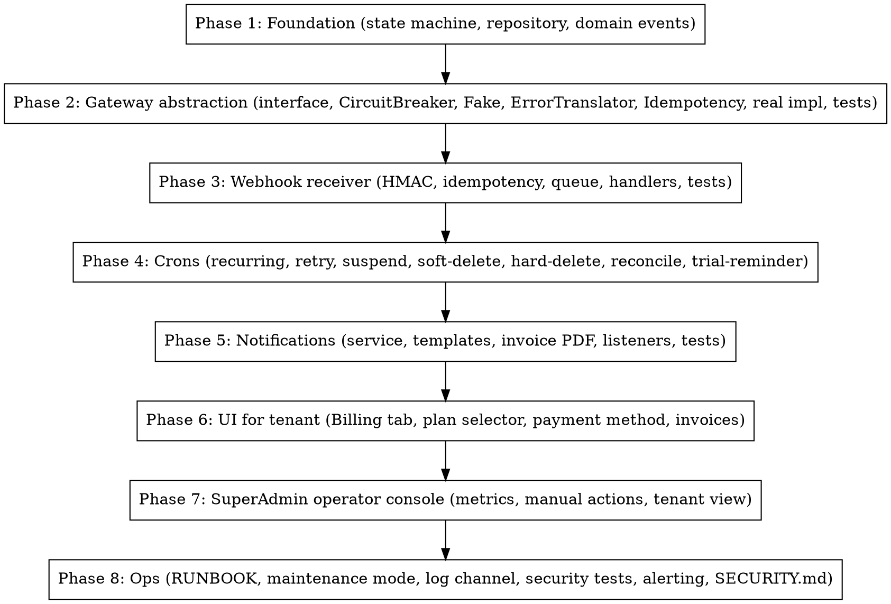
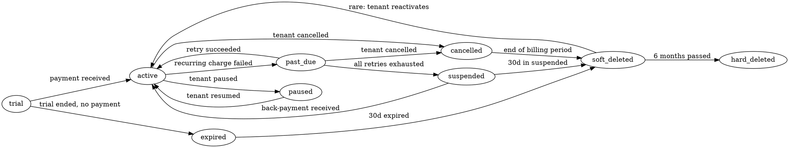

# Laravel SaaS Billing Infrastructure

You are building the **payment plumbing** of a multi-tenant SaaS. This is the most-regulated, most-irreversible part of any product: charging the wrong amount, leaking a token, or missing a webhook costs real money and real trust. This skill captures the **8-phase implementation** that survived a real production SaaS launch with Wompi (Colombian payment gateway), 9 subscription states, dunning automation, and PCI-grade discipline.

**Origin:** Distilled from POSLatam's billing module: 8 phases, ~40 PRs, ~1500 lines of pro-grade code, full PHPUnit + security tests + Wompi sandbox smoke. **This skill is paranoid by default** — every constraint here exists because we ate a bug in it.

**Companion skills (read first if relevant):**
- `saas-plan-gating-billing` — WHEN to gate features by plan (Pattern B, FeatureGate, UsageTracker)
- `laravel-saas-architecture-decisions` — the pro-grade discipline this skill applies surgically
- `saas-testing-dual-layer` — PCI smoke tests + integration patterns

## When to use this skill

Activate this skill when:
- Integrating ANY payment gateway (Wompi, Stripe, Mercadopago, Conekta, Culqi, MercadoPago, PayU, etc.)
- Designing the `subscriptions` table or related schema
- Receiving webhooks from a payment provider
- Implementing recurring charges or trial-to-paid conversion
- Building dunning (retry failed payments)
- Adding the SuperAdmin / SaaS operator console
- Handling refunds, chargebacks, disputes
- Implementing invoice PDF generation
- Designing alerting / Sentry thresholds for billing failures
- Writing the billing RUNBOOK / SECURITY.md
- ANYTHING that touches money, card tokens, or PII

## The 8 phases — implementation order (do NOT skip ahead)



**Why this order matters**: foundation before gateway prevents you from coupling state to a specific provider. Gateway before webhooks because the webhook needs the gateway's `verifyWebhookSignature()`. Webhooks before crons because cron retry events go through the same handlers. Crons before notifications because notifications listen to cron-emitted events. UI last because everything else must work without UI.

---

## Phase 1 — Foundation

### 1.1 The 9-state subscription state machine

Every subscription is in **exactly one** of 9 states. **The state column on the model is the source of truth.** No `is_active`, no `is_cancelled` booleans — one enum, one State class per state.

```php
namespace App\Enums;

enum SubscriptionStatus: string
{
    case Trial = 'trial';                 // signup grace period (e.g. 14 days)
    case Active = 'active';                // paid + current
    case PastDue = 'past_due';             // last charge failed, in dunning
    case Paused = 'paused';                // tenant requested pause (rare, optional)
    case Cancelled = 'cancelled';          // tenant requested cancel, still active until period end
    case Expired = 'expired';              // trial ended without payment
    case Suspended = 'suspended';          // dunning exhausted, account in read-only mode
    case SoftDeleted = 'soft_deleted';     // grace ended, billing data preserved 6 months
    case HardDeleted = 'hard_deleted';     // 6 months passed, all PII purged
}
```

### 1.2 Valid transitions matrix



### 1.3 State pattern implementation

```php
namespace App\Domain\Subscription\States;

abstract class SubscriptionState
{
    public function __construct(protected Subscription $subscription) {}

    abstract public function name(): SubscriptionStatus;
    abstract public function canCharge(): bool;
    abstract public function canCancel(): bool;
    abstract public function canPause(): bool;
    abstract public function canResume(): bool;
    abstract public function canRefund(): bool;
    abstract public function isAccessible(): bool;    // can tenant USE the app?
    abstract public function isReadOnly(): bool;       // suspended → read-only

    /**
     * Transition to a new state. Throws if invalid.
     */
    abstract public function transitionTo(SubscriptionStatus $next): self;

    final public function applyTransition(SubscriptionStatus $next): void
    {
        $new = $this->transitionTo($next);
        $this->subscription->status = $new->name();
        $this->subscription->save();

        event(new SubscriptionStateChanged(
            tenantId: $this->subscription->tenant_id,
            subscriptionId: $this->subscription->id,
            from: $this->name(),
            to: $new->name(),
            correlationId: request()->header('X-Correlation-Id') ?? Str::uuid()->toString(),
        ));
    }
}
```

Each concrete state implements the abstract methods. Example:

```php
final class ActiveState extends SubscriptionState
{
    public function name(): SubscriptionStatus { return SubscriptionStatus::Active; }
    public function canCharge(): bool { return true; }
    public function canCancel(): bool { return true; }
    public function canPause(): bool { return true; }
    public function canResume(): bool { return false; }
    public function canRefund(): bool { return true; }
    public function isAccessible(): bool { return true; }
    public function isReadOnly(): bool { return false; }

    public function transitionTo(SubscriptionStatus $next): SubscriptionState
    {
        return match ($next) {
            SubscriptionStatus::PastDue   => new PastDueState($this->subscription),
            SubscriptionStatus::Paused    => new PausedState($this->subscription),
            SubscriptionStatus::Cancelled => new CancelledState($this->subscription),
            default => throw new InvalidSubscriptionTransitionException(
                "Active cannot transition to {$next->value}"
            ),
        };
    }
}
```

### 1.4 SubscriptionRepository (the only place that bypasses tenant scope)

```php
namespace App\Domain\Subscription\Repositories;

final class SubscriptionRepository
{
    /**
     * Cross-tenant query — bypasses BelongsToTenant global scope.
     * Used by cron commands that iterate ALL tenants (dunning, reconciliation).
     * Access check: commands run via scheduler only, no HTTP entry point.
     */
    public function allDueForRecurringCharge(Carbon $asOf): Collection
    {
        return Subscription::withoutGlobalScopes()
            ->where('status', SubscriptionStatus::Active)
            ->where('next_billing_at', '<=', $asOf)
            ->where('next_billing_at', '>', $asOf->copy()->subDays(7))
            ->get();
    }

    public function allInState(SubscriptionStatus $status, ?Carbon $olderThan = null): Collection
    {
        $q = Subscription::withoutGlobalScopes()->where('status', $status);
        if ($olderThan) $q->where('updated_at', '<', $olderThan);
        return $q->get();
    }
}
```

### 1.5 Domain events (the audit + notification bridge)

```php
namespace App\Domain\Subscription\Events;

final class SubscriptionStarted { /* trial → active */ }
final class SubscriptionRenewed { /* recurring charge succeeded */ }
final class SubscriptionChargeFailed { /* recurring charge failed */ }
final class SubscriptionStateChanged { /* any transition */ }
final class SubscriptionCancelled { /* tenant cancelled */ }
final class SubscriptionSuspended { /* dunning exhausted */ }
final class RefundIssued { /* manual or webhook-driven */ }
final class ChargebackReceived { /* webhook */ }
```

Each event is `final` and `readonly`. Stores: `tenant_id`, `subscription_id`, `correlation_id`, `metadata` (whatever's relevant). Listeners write to audit log + dispatch notifications.

### 1.6 Audit log (append-only)

```php
Schema::create('billing_audit_log', function (Blueprint $table) {
    $table->id();
    $table->foreignId('tenant_id')->constrained()->cascadeOnDelete();
    $table->foreignId('subscription_id')->nullable()->constrained()->nullOnDelete();
    $table->string('event_type');           // SubscriptionStarted, ChargeFailed, etc.
    $table->json('payload');                 // serialized event data (NO sensitive fields)
    $table->string('correlation_id')->index();
    $table->timestamp('occurred_at');
    $table->timestamps();
    // NO update_at modifier — this table is append-only
});
```

**Doctrine**: `Model::saving()` hook on this model throws if `exists` is true. The only way to "modify" an audit log entry is to append a corrective entry.

---

## Phase 2 — Gateway abstraction

### 2.1 PaymentGatewayInterface

```php
namespace App\Services\Billing\Gateways;

interface PaymentGatewayInterface
{
    public function charge(#[\SensitiveParameter] ChargeData $data): ChargeResult;

    public function refund(string $transactionId, int $amountCents, string $idempotencyKey): RefundResult;

    public function tokenize(#[\SensitiveParameter] CardData $card): TokenResult;

    public function detokenize(string $token): ?array; // returns last4, brand, expMonth/Year — never PAN

    public function verifyWebhookSignature(string $payload, string $signature): bool;

    public function getTransaction(string $transactionId): ?TransactionResult;
}
```

All DTOs (`ChargeData`, `CardData`) have `__debugInfo()` that masks sensitive fields.

### 2.2 CircuitBreaker — separate keys per call type

```php
namespace App\Services\Billing\Support;

final class CircuitBreaker
{
    private const FAILURE_THRESHOLD = 5;
    private const COOLDOWN_SECONDS = 60;

    public function __construct(private string $key) {}

    public function execute(callable $fn): mixed
    {
        if ($this->isOpen()) {
            throw new CircuitOpenException("Circuit {$this->key} is open");
        }
        try {
            $result = $fn();
            $this->recordSuccess();
            return $result;
        } catch (\Throwable $e) {
            $this->recordFailure();
            throw $e;
        }
    }
    // ... isOpen(), recordSuccess(), recordFailure() use Redis
}
```

**CRITICAL**: instantiate **separate breakers per call type**. A broken `gateway:auth` endpoint should NOT prevent `gateway:charge` from being attempted (they're separate services on the provider's side).

```php
$authBreaker = new CircuitBreaker('gateway:wompi:auth');
$apiBreaker  = new CircuitBreaker('gateway:wompi:api');
```

### 2.3 FakeGateway — with force flags for tests

```php
final class FakeGateway implements PaymentGatewayInterface
{
    public bool $forceChargeFailure = false;
    public bool $forceNetworkError = false;
    public ?string $forceErrorCode = null;
    public bool $forceWebhookSignatureInvalid = false;
    public array $chargedAmounts = [];          // recorded for assertions
    public array $refundsIssued = [];

    public function charge(#[\SensitiveParameter] ChargeData $data): ChargeResult
    {
        if ($this->forceNetworkError) {
            throw new \Illuminate\Http\Client\ConnectionException('Fake network error');
        }
        if ($this->forceChargeFailure) {
            return ChargeResult::failed(
                code: $this->forceErrorCode ?? 'declined',
                message: 'Card declined (fake)',
            );
        }
        $this->chargedAmounts[] = $data->amountCents;
        return ChargeResult::succeeded('fake_tx_' . Str::uuid());
    }
    // ... refund, tokenize, etc.
}
```

Register in test environment via container: `$this->app->instance(PaymentGatewayInterface::class, new FakeGateway());`.

### 2.4 ErrorTranslator (provider-specific error → app-domain error)

Each gateway returns errors in its own format. Translate to your domain language so the rest of the app doesn't know if you're on Wompi or Stripe:

```php
final class WompiErrorTranslator
{
    private const MAP = [
        'INSUFFICIENT_FUNDS' => GatewayError::InsufficientFunds,
        'CARD_DECLINED'      => GatewayError::CardDeclined,
        'INVALID_CVC'        => GatewayError::InvalidCvc,
        'EXPIRED_CARD'       => GatewayError::ExpiredCard,
        'FRAUD_REJECTED'     => GatewayError::FraudRejected,
        'STOLEN_CARD'        => GatewayError::FraudRejected,
        'LOST_CARD'          => GatewayError::FraudRejected,
        'NETWORK_ERROR'      => GatewayError::NetworkError,
        // ... ~30 codes
    ];

    public function translate(string $providerCode): GatewayError
    {
        return self::MAP[$providerCode] ?? GatewayError::UnknownError;
    }
}
```

```php
enum GatewayError: string {
    case InsufficientFunds = 'insufficient_funds';
    case CardDeclined = 'card_declined';
    case InvalidCvc = 'invalid_cvc';
    case ExpiredCard = 'expired_card';
    case FraudRejected = 'fraud_rejected';
    case NetworkError = 'network_error';
    case UnknownError = 'unknown_error';
    // ...

    public function isRetryable(): bool
    {
        return match ($this) {
            self::NetworkError => true,
            self::UnknownError => true,
            default => false,
        };
    }
}
```

### 2.5 IdempotencyService — every money operation MUST have one

```php
namespace App\Services\Billing\Support;

final class IdempotencyService
{
    public function execute(
        string $key,
        string $operation,           // 'charge', 'refund', 'tokenize'
        int $tenantId,
        callable $fn,
    ): mixed {
        $record = IdempotentOperation::firstOrCreate(
            ['key' => $key, 'operation' => $operation, 'tenant_id' => $tenantId],
            ['status' => 'pending', 'expires_at' => now()->addHours(24)],
        );

        if ($record->wasRecentlyCreated === false) {
            if ($record->status === 'completed') {
                return unserialize($record->result);
            }
            if ($record->status === 'pending') {
                throw new IdempotencyInProgressException(
                    "Operation {$key} still in progress, retry later"
                );
            }
        }

        try {
            $result = $fn();
            $record->update(['status' => 'completed', 'result' => serialize($result)]);
            return $result;
        } catch (\Throwable $e) {
            $record->update(['status' => 'failed', 'error_message' => $e->getMessage()]);
            throw $e;
        }
    }
}
```

```php
Schema::create('idempotent_operations', function (Blueprint $table) {
    $table->id();
    $table->string('key');
    $table->string('operation');
    $table->foreignId('tenant_id')->constrained()->cascadeOnDelete();
    $table->enum('status', ['pending', 'completed', 'failed']);
    $table->text('result')->nullable();
    $table->text('error_message')->nullable();
    $table->timestamp('expires_at');
    $table->timestamps();
    $table->unique(['key', 'operation', 'tenant_id']); // CRITICAL — DB-level dedup
});
```

**The UNIQUE constraint at DB level is the source of truth.** In-memory cache or Redis check is fine for fast-path, but the DB must enforce.

### 2.6 Real gateway implementation (Wompi example)

```php
final class WompiGateway implements PaymentGatewayInterface
{
    public function __construct(
        #[\SensitiveParameter] private string $privateKey,
        #[\SensitiveParameter] private string $publicKey,
        #[\SensitiveParameter] private string $eventsSecret,  // for webhook HMAC
        private string $baseUrl,
        private WompiErrorTranslator $errorTranslator,
        private CircuitBreaker $apiBreaker,
        private LoggerInterface $logger,
    ) {}

    public function charge(#[\SensitiveParameter] ChargeData $data): ChargeResult
    {
        $correlationId = Str::uuid()->toString();
        try {
            return $this->apiBreaker->execute(function () use ($data, $correlationId) {
                $response = Http::withToken($this->privateKey)
                    ->timeout(15)
                    ->post("{$this->baseUrl}/v1/transactions", [
                        'amount_in_cents' => $data->amountCents,
                        'currency' => $data->currency,
                        'customer_email' => $data->customerEmail,
                        'payment_method' => ['installments' => 1, 'token' => $data->cardToken],
                        'reference' => $data->reference,
                    ]);

                if (! $response->successful()) {
                    // CRITICAL: do NOT include $response->body() — may contain token
                    $this->logError('charge_failed', $response->status(), $correlationId);
                    return ChargeResult::failed(
                        code: $this->errorTranslator->translate(
                            $response->json('error.reason', 'UNKNOWN')
                        )->value,
                        message: 'Payment failed',
                    );
                }

                return ChargeResult::succeeded($response->json('data.id'));
            });
        } catch (\Throwable $e) {
            $this->logException($e, $correlationId);
            throw new GatewayException('Charge failed', previous: null); // no original exception
        }
    }

    public function verifyWebhookSignature(string $payload, string $signature): bool
    {
        $expected = hash_hmac('sha256', $payload, $this->eventsSecret);
        return hash_equals($expected, $signature); // timing-safe
    }

    /**
     * NEVER include $response->body() in exception/log.
     * Body may contain card token. Only correlation hint + status.
     */
    private function logException(\Throwable $e, string $correlationId): void
    {
        $this->logger->error('gateway_call_failed', [
            'error_class' => $e::class,
            'error_message' => $e->getMessage(),
            'correlation_id' => $correlationId,
        ]);
    }
}
```

### 2.7 Phase 2 tests

- Unit test every state transition (valid + invalid throws)
- Feature test charge happy path with FakeGateway
- Feature test each force flag (forceChargeFailure → ChargeResult::failed; forceNetworkError → exception)
- Sandbox smoke test against real Wompi/Stripe sandbox with test cards (one per error case)
- Idempotency: call `charge()` twice with same key → second returns cached result, only one DB row
- PCI smoke: throw exception with card data → assert token NOT in `getTrace()`, `__toString()`, `serialize()`, `print_r()`

---

## Phase 3 — Webhook receiver

### 3.1 Controller (fast — must respond <2s)

```php
final class WompiWebhookController
{
    public function __invoke(Request $request, PaymentGatewayInterface $gateway): Response
    {
        $payload = $request->getContent();
        $signature = $request->header('X-Event-Checksum');

        // 1. HMAC verify — reject anything not signed by us
        if (! $signature || ! $gateway->verifyWebhookSignature($payload, $signature)) {
            abort(401);
        }

        $event = json_decode($payload, true);
        $eventId = $event['id'] ?? null;
        if (! $eventId) abort(400);

        // 2. Idempotency — never process same event twice
        $stored = WebhookEvent::firstOrCreate(
            ['event_id' => $eventId, 'provider' => 'wompi'],
            ['payload' => $payload, 'received_at' => now(), 'status' => 'received'],
        );
        if (! $stored->wasRecentlyCreated) {
            return response()->noContent(); // already processed (or in-flight)
        }

        // 3. Dispatch to queue — return fast
        ProcessWompiWebhookEvent::dispatch($stored->id);

        return response()->noContent();
    }
}
```

```php
Schema::create('webhook_events', function (Blueprint $table) {
    $table->id();
    $table->string('provider');           // 'wompi', 'stripe', etc.
    $table->string('event_id');
    $table->text('payload');               // raw body for replay
    $table->timestamp('received_at');
    $table->timestamp('processed_at')->nullable();
    $table->enum('status', ['received', 'processing', 'completed', 'failed']);
    $table->text('error_message')->nullable();
    $table->timestamps();
    $table->unique(['provider', 'event_id']);  // hard idempotency
});
```

### 3.2 Job — does the actual work async

```php
final class ProcessWompiWebhookEvent implements ShouldQueue
{
    public function __construct(public int $webhookEventId) {}

    public function handle(): void
    {
        $event = WebhookEvent::findOrFail($this->webhookEventId);
        $event->update(['status' => 'processing']);

        try {
            $payload = json_decode($event->payload, true);
            $eventType = $payload['event'] ?? '';
            $handler = match ($eventType) {
                'transaction.updated'   => app(TransactionUpdatedHandler::class),
                'transaction.refunded'  => app(TransactionRefundedHandler::class),
                'chargeback.created'    => app(ChargebackHandler::class),
                default => null,
            };
            if (! $handler) {
                $event->update(['status' => 'completed', 'error_message' => 'unknown_event_type, ignored']);
                return;
            }
            $handler->handle($payload['data']);
            $event->update(['status' => 'completed', 'processed_at' => now()]);
        } catch (\Throwable $e) {
            $event->update(['status' => 'failed', 'error_message' => $e->getMessage()]);
            throw $e; // re-queue
        }
    }

    public function retryUntil(): \DateTime { return now()->addHours(24); }
    public function backoff(): array { return [60, 300, 900, 3600]; } // 1m, 5m, 15m, 1h
}
```

### 3.3 Handlers (one per event type)

```php
final class TransactionUpdatedHandler
{
    public function handle(array $data): void
    {
        $subscription = Subscription::withoutGlobalScopes()
            ->where('gateway_subscription_id', $data['reference'])
            ->firstOrFail();

        $status = $data['status']; // 'APPROVED', 'DECLINED', 'VOIDED', 'ERROR'

        match ($status) {
            'APPROVED' => $this->markAsRenewed($subscription, $data),
            'DECLINED', 'ERROR' => $this->markAsFailed($subscription, $data),
            'VOIDED' => $this->markAsCancelled($subscription, $data),
            default => null,
        };
    }

    private function markAsRenewed(Subscription $sub, array $data): void
    {
        $state = $sub->getState();
        if ($state->canCharge()) {
            $state->applyTransition(SubscriptionStatus::Active);
            $sub->update(['next_billing_at' => now()->addMonth(), 'last_paid_at' => now()]);
            event(new SubscriptionRenewed(/* ... */));
        }
    }
    // ...
}
```

### 3.4 Webhook tests E2E

- HMAC bypass: send POST without signature → 401
- HMAC bypass: send with wrong signature → 401
- Idempotency: send same event_id twice → first 204, second 204 (no duplicate processing)
- transaction.updated APPROVED → subscription Active, SubscriptionRenewed emitted
- transaction.updated DECLINED → subscription PastDue, SubscriptionChargeFailed emitted
- transaction.refunded → balance adjusted, audit log entry, RefundIssued emitted
- chargeback.created → audit + Owner notified, subscription NOT auto-suspended (manual review)
- Replay attack: send a 30-day-old event → reject (consider `received_at` window)

---

## Phase 4 — Crons (the daily heartbeat)

8 commands, run by `app/Console/Kernel.php` schedule. **All commands respect `billing:maintenance` mode** (skip if maintenance is on).

### 4.1 DunningService (orchestrator, not a command itself)

```php
final class DunningService
{
    public function attemptRetry(Subscription $sub, ChargeAttempt $attempt): RetryResult
    {
        if (! $sub->getState()->canCharge()) {
            return RetryResult::skipped('state_not_chargeable');
        }
        try {
            $result = $this->gateway->charge(/* card token from sub */);
            if ($result->isSuccess()) {
                $sub->getState()->applyTransition(SubscriptionStatus::Active);
                return RetryResult::success($result->transactionId);
            }
            return RetryResult::failed($result->errorCode);
        } catch (CircuitOpenException $e) {
            return RetryResult::circuitOpen();
        }
    }
}
```

### 4.2 `php artisan billing:process-recurring-charges` — daily, 02:00

Iterates subscriptions where `next_billing_at <= today AND status = active`. Charges each via gateway. On success: extend `next_billing_at`. On failure: transition to PastDue + schedule first retry.

### 4.3 `php artisan billing:retry-dunning` — daily, 03:00

Iterates `past_due` subscriptions with `retry_count < 3` and `next_retry_at <= now`. Attempts retry. Schedule pattern: day 3, day 7, day 14.

### 4.4 `php artisan billing:suspend-overdue` — daily, 04:00

Iterates `past_due` with `retry_count >= 3` or `past_due_since > 14 days`. Transitions to Suspended. Account becomes read-only.

### 4.5 `php artisan billing:soft-delete-cancelled` — daily, 05:00

Iterates `cancelled` where billing period ended. Transitions to SoftDeleted. PII preserved for compliance retention.

### 4.6 `php artisan billing:hard-delete-old` — daily, 06:00

Iterates `soft_deleted` older than 180 days. Purges PII (card tokens, billing addresses), keeps anonymized audit log entries for 5 years (tax compliance).

### 4.7 `php artisan billing:reconcile-subscriptions` — daily, 07:00

For each tenant subscription, fetch `gateway->getTransaction(last_tx_id)` and compare status. Flag discrepancies (e.g. gateway says "refunded" but our DB says "active"). Output to `reconciliation_discrepancies` table for manual review.

**Critical**: respect `billing:maintenance` flag — skip during maintenance windows or you'll mis-reconcile during a migration.

### 4.8 `php artisan billing:send-trial-reminders` — daily, 08:00

Find trial subscriptions ending in 3 days. Dispatch `TrialEndingNotification`. Idempotent (track which we've notified to avoid spam).

### 4.9 Schedule registration

```php
// app/Console/Kernel.php (or app/Console/routes.php in Laravel 12)
$schedule->command('billing:process-recurring-charges')->dailyAt('02:00');
$schedule->command('billing:retry-dunning')->dailyAt('03:00');
$schedule->command('billing:suspend-overdue')->dailyAt('04:00');
$schedule->command('billing:soft-delete-cancelled')->dailyAt('05:00');
$schedule->command('billing:hard-delete-old')->dailyAt('06:00');
$schedule->command('billing:reconcile-subscriptions')->dailyAt('07:00');
$schedule->command('billing:send-trial-reminders')->dailyAt('08:00');
```

All commands MUST be idempotent — re-running them shouldn't cause double-charges or double-notifications.

---

## Phase 5 — Notifications

### 5.1 NotificationService — multi-channel

```php
final class BillingNotificationService
{
    public function send(BillingNotification $notification, Subscription $sub): void
    {
        $tenant = $sub->tenant;
        $owner = $tenant->owner();

        // Email channel (Resend, SES, Postmark)
        if ($owner->email && $notification->shouldEmail()) {
            Mail::to($owner)->send($notification->toMailable($sub));
        }

        // WhatsApp channel (build wa.me link with pre-filled text)
        if ($owner->whatsapp && $notification->shouldWhatsApp()) {
            $url = 'https://wa.me/' . $owner->whatsapp
                . '?text=' . urlencode($notification->whatsappText($sub));
            $owner->notify(new WhatsAppLinkNotification($url));
        }

        // In-app notification (database driver)
        $owner->notify($notification->toInApp($sub));
    }
}
```

### 5.2 The 7 templates (minimum)

1. **TrialEndingNotification** — "Your trial ends in 3 days. Add a card to keep your data."
2. **ChargeSucceededNotification** — "We charged $X to your card. Invoice attached."
3. **ChargeFailedNotification** — "Your last charge failed. Update your card or we'll retry in 3 days."
4. **SubscriptionSuspendedNotification** — "Your account is suspended. Pay $X to restore access."
5. **SubscriptionResumedNotification** — "Welcome back! Your account is active again."
6. **SubscriptionCancelledNotification** — "Your subscription is cancelled. You'll have access until {date}."
7. **InvoiceReadyNotification** — "Your monthly invoice is ready (PDF attached)."

Each Mailable uses `TenantAwareMailable` trait (From = tenant's brand name, Reply-To = owner's email, headers `X-Tenant-Id` / `X-Tenant-Slug`).

### 5.3 InvoicePdfService — dompdf

```php
final class InvoicePdfService
{
    public function generate(Invoice $invoice): string  // returns path to PDF
    {
        $tenant = $invoice->subscription->tenant;
        $pdf = PDF::loadView('billing.invoice', [
            'invoice' => $invoice,
            'tenant' => $tenant,
            'plan' => $invoice->subscription->plan,
        ]);
        $path = "invoices/{$tenant->id}/{$invoice->number}.pdf";
        Storage::put($path, $pdf->output());
        return $path;
    }
}
```

Invoice number format: `INV-YYYYMMDD-{tenant_id}-{sequential}`. Stored in `invoices` table with `tenant_id`, `subscription_id`, `amount_cents`, `currency`, `pdf_path`, `paid_at`, `number` (unique).

### 5.4 Listeners — domain events → notifications

```php
namespace App\Listeners\Billing;

final class SendChargeFailedNotification
{
    public function __construct(
        private BillingNotificationService $notifications,
    ) {}

    public function handle(SubscriptionChargeFailed $event): void
    {
        $sub = Subscription::withoutGlobalScopes()->findOrFail($event->subscriptionId);
        $this->notifications->send(new ChargeFailedNotification(), $sub);
    }
}
```

Register in `EventServiceProvider`:
```php
protected $listen = [
    SubscriptionStarted::class => [SendWelcomeEmail::class],
    SubscriptionChargeFailed::class => [SendChargeFailedNotification::class],
    SubscriptionRenewed::class => [SendInvoiceEmail::class, GenerateInvoicePdf::class],
    SubscriptionSuspended::class => [SendSuspendedNotification::class, NotifyOpsTeam::class],
    // ...
];
```

### 5.5 Phase 5 tests

- TrialEndingNotification dispatched 3 days before trial end, not 4, not 2
- ChargeSucceeded → Invoice PDF generated AND email sent with PDF attached
- ChargeFailed → email sent with retry CTA + link to update card
- Notification rate-limit: don't send 10 "failed charge" emails in one day if cron retries 3x
- Tenant suppression list: bounced email doesn't retry until 7 days
- Cross-tenant isolation: Tenant A's billing notifications never reach Tenant B's email

---

## Phase 6 — Tenant-facing UI (Billing tab)

Built within the tenant's `/account/billing/*` namespace. Pages:

| Route | Purpose | Owner-only? |
|---|---|---|
| `/account/billing` | Current plan + next charge date + recent invoices | Yes |
| `/account/billing/plans` | Plan comparison + upgrade/downgrade CTA | Yes |
| `/account/billing/payment-method` | Update card via gateway iframe (NEVER store PAN) | Yes |
| `/account/billing/invoices` | Invoice list + download PDF | Yes |
| `/account/billing/cancel` | Cancel flow with retention questions | Yes |

**ALL billing routes gated by `feature:billing` middleware + `can_see_all_branches()` policy.** Branch Managers never see billing.

**Plan upgrade flow**:
1. User picks new plan on `/account/billing/plans`
2. Confirm with diff: "You'll be charged $X today (prorated), then $Y/month"
3. Call gateway to charge prorated amount
4. On success: update subscription, emit SubscriptionPlanChanged event
5. Redirect to `/account/billing` with success flash

**NEVER store the card PAN in your DB.** Use the gateway's iframe / tokenization SDK. Store only the `card_token` (encrypted Eloquent cast) + `card_last4` + `card_brand` + `card_exp_month/year` for display.

---

## Phase 7 — SuperAdmin operator console

The SaaS operator (you) needs:

### 7.1 BillingMetricsService

```php
final class BillingMetricsService
{
    public function mrr(?Carbon $asOf = null): int { /* sum of active subscription plan prices, cents */ }
    public function churnRate(Carbon $month): float { /* cancelled / total at start of month */ }
    public function conversionRate(Carbon $month): float { /* trial→paid / total trials started */ }
    public function planDistribution(): array { /* ['basic' => 120, 'pro' => 45, 'enterprise' => 8] */ }
    public function arpu(): int { /* average revenue per user, cents */ }
    public function ltv(): int { /* lifetime value estimate */ }
}
```

### 7.2 SuperAdminBillingActionService — manual operations

```php
final class SuperAdminBillingActionService
{
    public function extendTrial(Tenant $tenant, int $additionalDays, User $operator, string $reason): void
    {
        // 1. Authorize: operator must be super_admin
        abort_unless($operator->is_super_admin, 403);
        // 2. Action
        $sub = $tenant->activeSubscription();
        $sub->trial_ends_at = $sub->trial_ends_at->addDays($additionalDays);
        $sub->save();
        // 3. Audit
        BillingAuditLog::create([
            'tenant_id' => $tenant->id,
            'event_type' => 'TrialExtended',
            'payload' => ['days' => $additionalDays, 'operator_id' => $operator->id, 'reason' => $reason],
            'correlation_id' => Str::uuid()->toString(),
            'occurred_at' => now(),
        ]);
    }

    public function manualRefund(Invoice $invoice, int $amountCents, User $operator, string $reason): void { /* ... */ }
    public function manualSuspend(Tenant $tenant, User $operator, string $reason): void { /* ... */ }
    public function manualReactivate(Tenant $tenant, User $operator, string $reason): void { /* ... */ }
    public function forceCharge(Subscription $sub, User $operator, string $reason): void { /* idempotent */ }
}
```

**Every action requires `$reason`** stored in audit log. Operator accountability is mandatory for chargebacks / disputes.

### 7.3 SuperAdmin/BillingController + routes

```php
Route::middleware(['auth', 'super_admin'])->prefix('super-admin/billing')->group(function () {
    Route::get('/', [BillingController::class, 'dashboard'])->name('super.billing.dashboard');
    Route::get('/tenants', [BillingController::class, 'tenants'])->name('super.billing.tenants');
    Route::get('/tenants/{tenant}', [BillingController::class, 'tenantDetail'])->name('super.billing.tenant');
    Route::get('/invoices', [BillingController::class, 'invoices'])->name('super.billing.invoices');
    Route::post('/tenants/{tenant}/extend-trial', [BillingController::class, 'extendTrial']);
    Route::post('/tenants/{tenant}/refund', [BillingController::class, 'refund']);
    // ...
});
```

The `super_admin` middleware: `abort_unless($request->user()->is_super_admin, 403);`. No exceptions.

### 7.4 Vue pages (Tier 3 design)

- `SuperAdmin/Billing/Dashboard.vue` — MRR, churn, conversion, plan distribution charts
- `SuperAdmin/Billing/Tenants.vue` — searchable/sortable list of all tenant subscriptions
- `SuperAdmin/Billing/TenantDetail.vue` — single tenant: subscription, invoices, audit log, actions
- `SuperAdmin/Billing/Invoices.vue` — global invoice search

### 7.5 Phase 7 tests

- Super admin gate: regular admin gets 403 on `/super-admin/billing/*`
- URL manipulation doesn't leak other tenants' details
- Manual refund: only super_admin can call, audit log entry created
- Manual suspend: tenant becomes read-only immediately, owner notified
- Metrics no-leak: MRR computation doesn't include test/seed tenants (filter by `is_demo` flag)

---

## Phase 8 — Ops

### 8.1 RUNBOOK (docs/billing/RUNBOOK.md)

Sections:
- **Maintenance mode**: `php artisan billing:maintenance enable` / `disable` / `status --format=json`
  - When enabled: webhook controller queues but doesn't process; crons skip; UI shows banner
  - Use during DB migrations, gateway provider maintenance, security incidents
- **Handle stuck subscription**: state diagram + tinker recipes
- **Manual refund procedure**: when to issue, how to log in super admin, gateway side-effects
- **Webhook secret rotation**: old + new secret tolerated for 24h window
- **Failed reconciliation**: comparison query, manual reconcile command
- **Chargeback received**: review steps, dispute timeline, manual suspend if fraud

### 8.2 Log channel — dedicated `billing` channel

```php
// config/logging.php
'billing' => [
    'driver' => 'daily',
    'path' => storage_path('logs/billing/billing.log'),
    'level' => 'debug',
    'days' => 1825,  // 5 years retention for tax compliance
    'permission' => 0600,
],
```

Usage: `Log::channel('billing')->info('charge_succeeded', [...])`. Separate file makes audit / forensics tractable.

**5-year retention is non-negotiable in most jurisdictions for tax/AML compliance.** Check your country's specifics (in Colombia: 5 years; Mexico: 5; Argentina: 10; check yours).

### 8.3 Security tests (obligatory before launch)

`tests/Security/Billing*` covers:
- HMAC bypass on webhook → 401
- HMAC replay (30+ days old timestamp) → 401
- Idempotency bypass (same key twice with different body) → 409
- Super admin gate bypass on any `/super-admin/billing/*` route → 403
- Token expiry on Sanctum API → 401
- Cross-tenant billing data leak attempts (Tenant A tries to read Tenant B invoice) → 404
- PCI smoke (see below)

### 8.4 PCI smoke tests

Reflection-based verifications:

```php
public function test_sensitive_parameter_attributes_present(): void
{
    $methods = [
        [WompiGateway::class, 'charge'],
        [WompiGateway::class, 'tokenize'],
        [WompiGateway::class, '__construct'],
    ];
    foreach ($methods as [$class, $method]) {
        $r = new ReflectionMethod($class, $method);
        foreach ($r->getParameters() as $param) {
            $isSensitive = ! empty($param->getAttributes(\SensitiveParameter::class));
            $shouldBe = in_array($param->getName(), ['data', 'card', 'privateKey', 'eventsSecret']);
            $this->assertEquals($shouldBe, $isSensitive,
                "{$class}::{$method}() param \${$param->getName()} #[\\SensitiveParameter] attribute mismatch"
            );
        }
    }
}

public function test_card_token_does_not_leak_in_stack_trace(): void
{
    $card = new CardData(number: '4111111111111111', cvv: '123', expMonth: '12', expYear: '2030');
    $e = new \RuntimeException('boom', 0, new \RuntimeException(serialize($card)));
    $this->assertStringNotContainsString('4111111111111111', $e->getTraceAsString());
    $this->assertStringNotContainsString('4111111111111111', (string) $e);
    $this->assertStringNotContainsString('4111111111111111', print_r($e, true));
    $this->assertStringNotContainsString('4111111111111111', var_export($e, true));
}

public function test_gateway_does_not_log_response_body_on_failure(): void
{
    Log::shouldReceive('error')
        ->once()
        ->withArgs(function ($message, $context) {
            return ! str_contains(json_encode($context), 'TOKEN_FROM_GATEWAY');
        });
    Http::fake([
        '*' => Http::response(['error' => ['message' => 'TOKEN_FROM_GATEWAY']], 500),
    ]);
    $gateway = app(WompiGateway::class);
    try { $gateway->charge(/* ... */); } catch (\Throwable $e) {}
}
```

### 8.5 Alerting (Sentry + PagerDuty / Opsgenie thresholds)

| Metric | Threshold | Severity | Why |
|---|---|---|---|
| Failed charge rate | > 5% in last hour | P1 | Gateway issue or our integration broken |
| Webhook processing latency | p95 > 30s | P2 | Queue worker behind |
| Webhook 5xx rate | > 1% | P1 | Our handler is broken |
| Circuit breaker open count | > 0 | P2 | Gateway flapping |
| Reconciliation discrepancies | > 0 | P3 | Manual review needed |
| HMAC verification failures | > 10/hour | P2 | Possible attack |
| Idempotency conflicts | > 5/hour | P3 | Investigate client-side double-submits |
| SuperAdmin login | any | P3 | Audit, ops awareness |

### 8.6 SECURITY.md + RELEASE_NOTES at launch

Public `SECURITY.md` covers:
- Where to report vulnerabilities (security@yourdomain)
- PGP key for sensitive disclosure
- Bounty policy (or "no bounty, but credit")
- Disclosure timeline (90 days standard)
- Known PCI scope: SAQ-A (if you use gateway iframe / hosted fields) — adjust if you store card data

`RELEASE_NOTES.md` for the billing GA release:
- Date launched
- Features included (recurring charges, dunning, refunds, invoices)
- Known limitations (no multi-currency yet, no per-tenant tax rates, etc.)
- Migration notes for early-bird tenants

---

## Database schema cheatsheet

```php
// subscriptions
$table->id();
$table->foreignId('tenant_id')->constrained()->cascadeOnDelete();
$table->foreignId('plan_id')->constrained();
$table->string('status'); // enum SubscriptionStatus
$table->timestamp('trial_ends_at')->nullable();
$table->timestamp('next_billing_at')->nullable();
$table->timestamp('last_paid_at')->nullable();
$table->string('billing_period'); // monthly, yearly
$table->string('currency', 3);
$table->unsignedInteger('amount_cents');
$table->string('gateway_subscription_id')->nullable();
$table->string('gateway_customer_id')->nullable();
$table->string('card_token')->nullable(); // encrypted cast
$table->string('card_last4', 4)->nullable();
$table->string('card_brand', 20)->nullable();
$table->unsignedTinyInteger('card_exp_month')->nullable();
$table->unsignedSmallInteger('card_exp_year')->nullable();
$table->unsignedTinyInteger('retry_count')->default(0);
$table->timestamp('next_retry_at')->nullable();
$table->timestamp('past_due_since')->nullable();
$table->timestamps();
$table->softDeletes();
$table->index(['tenant_id', 'status']);
$table->index(['status', 'next_billing_at']);

// invoices
$table->id();
$table->foreignId('tenant_id')->constrained()->cascadeOnDelete();
$table->foreignId('subscription_id')->constrained();
$table->string('number')->unique(); // INV-YYYYMMDD-tenant-seq
$table->unsignedInteger('amount_cents');
$table->string('currency', 3);
$table->timestamp('issued_at');
$table->timestamp('paid_at')->nullable();
$table->string('pdf_path')->nullable();
$table->string('gateway_transaction_id')->nullable();
$table->timestamps();

// idempotent_operations (see Phase 2.5)
// webhook_events (see Phase 3.1)
// billing_audit_log (see Phase 1.6)

// reconciliation_discrepancies (manual review queue)
$table->id();
$table->foreignId('tenant_id')->constrained();
$table->foreignId('subscription_id')->constrained();
$table->json('our_state');
$table->json('gateway_state');
$table->string('diff_summary');
$table->boolean('resolved')->default(false);
$table->timestamp('detected_at');
$table->timestamps();
```

## Configuration — `.env` checklist

```ini
# Gateway credentials (NEVER commit)
WOMPI_ENV=production               # or sandbox
WOMPI_PRIVATE_KEY=...              # used in Authorization header
WOMPI_PUBLIC_KEY=...               # used in frontend tokenization iframe
WOMPI_EVENTS_SECRET=...            # used for webhook HMAC

# Billing operations
BILLING_TRIAL_DAYS=14
BILLING_DUNNING_RETRY_DAYS=3,7,14
BILLING_GRACE_AFTER_SUSPEND_DAYS=30
BILLING_HARD_DELETE_AFTER_DAYS=180
BILLING_LOG_RETENTION_DAYS=1825    # 5 years

# Alerting
SENTRY_LARAVEL_DSN=...
BILLING_ALERT_EMAIL=ops@yourdomain.com
BILLING_ALERT_WEBHOOK=https://hooks.slack.com/...
```

## Anti-patterns — never do this

- **Storing card PAN or CVV in your DB** — use gateway tokenization always. Even encrypted, you become PCI Level 1.
- **Putting `$response->body()` in an exception or log** — if the body contains a token, you just leaked it.
- **One shared idempotency key across charge + refund** — each operation gets its own scoped key.
- **Trusting webhook payload without HMAC verification** — anyone can POST to your endpoint.
- **Processing webhooks synchronously in the receiver** — gateway times out, retries, double-effect.
- **Webhook secret in code/config repo** — `.env` only, and rotate quarterly.
- **Running crons without idempotency** — a re-run of `process-recurring-charges` charges everyone twice.
- **One Circuit Breaker for all gateway endpoints** — auth failure shouldn't block charges.
- **Hardcoded plan slugs in gating logic** — use feature flags, plans evolve.
- **Storing webhook event without `unique(event_id, provider)`** — duplicates eventually arrive.
- **Hard-deleting tenant data on cancel** — many countries require 5+ years tax retention. Soft-delete with PII purge after grace.
- **Skipping the reconciliation cron** — eventually, your DB drifts from the gateway and you over/under-charge.
- **Manual refund without audit log + reason** — chargebacks demand evidence of operator action.
- **Updating subscription status by writing the column directly** — always through `$state->applyTransition()`. The State pattern is there for a reason.
- **No maintenance mode** — you'll need it during a migration, and learning that under fire is expensive.
- **Storing `is_super_admin` in the same enum as `admin`** — separate boolean column, separate gate, separate audit.
- **Letting Branch Managers see billing** — Owner-only, hard-enforced both backend AND UI.
- **Skipping security tests** — HMAC bypass + idempotency bypass + cross-tenant leak attempts are MANDATORY before launch.

## The "vendible software" pre-launch checklist

Before launching billing publicly:
- [ ] All 8 phases implemented and tested
- [ ] PHPUnit suite green (unit + feature + security + PCI smoke)
- [ ] Sandbox smoke test against real gateway (one test card per error code)
- [ ] Live test in staging with a real card and a real $1 charge → refund flow
- [ ] RUNBOOK reviewed by a second pair of eyes (you, in 6 months)
- [ ] SECURITY.md published
- [ ] Sentry alerts configured + tested (force a failure, verify alert fires)
- [ ] Maintenance mode tested (enable, verify webhook queues + cron skips, disable, verify resumed)
- [ ] Backup / restore procedure documented (DB backup includes encrypted card tokens — verify decryption works after restore)
- [ ] Tax compliance review (5-year retention configured, invoice format meets local requirements)
- [ ] Privacy policy mentions card data handling (PCI scope, gateway provider, retention)
- [ ] T&C cover billing terms (auto-renew, refund policy, dispute window)

## Cross-references

- `saas-plan-gating-billing` — WHEN to gate features (this skill is the implementation; that one is the strategy)
- `laravel-saas-multi-tenant-foundation` — tenant_id scope this builds on
- `laravel-saas-architecture-decisions` — pro-grade standards (Strategy, State, Idempotency, Circuit Breaker) all applied here
- `laravel-saas-auth-granularity` — SuperAdmin gate, Owner-only billing UI
- `saas-testing-dual-layer` — PCI smoke tests + Wompi sandbox smoke pattern
- `vue-inertia-frontend-system` — Billing UI in `/account/billing/*` namespace, Tier 3 design
