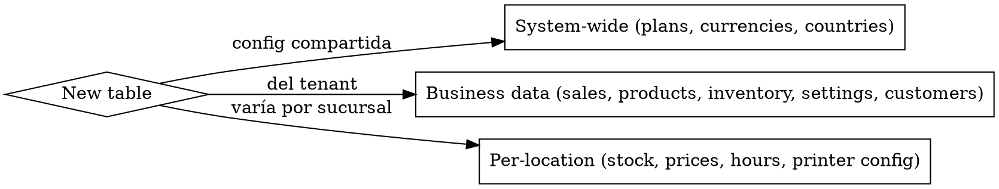
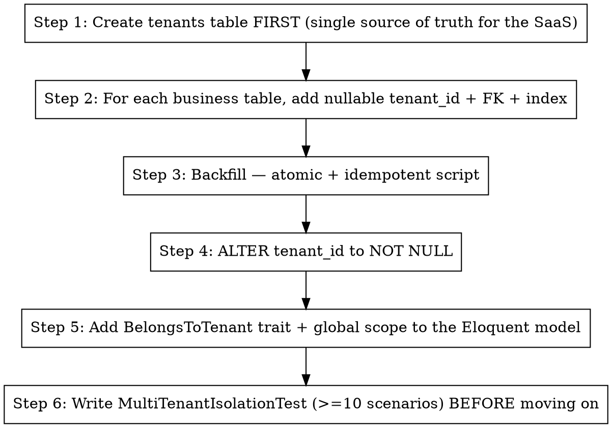
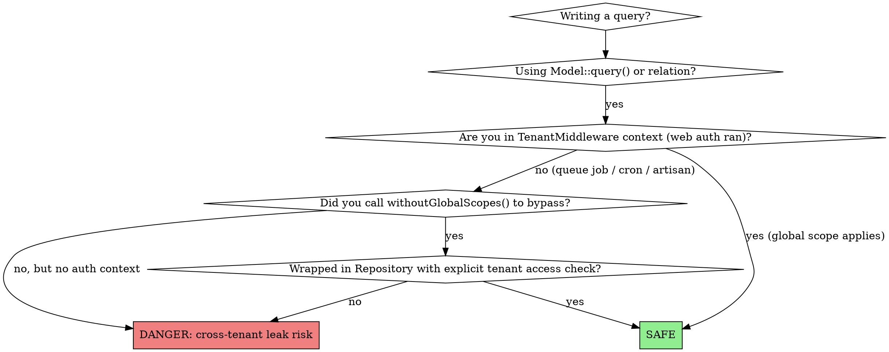

# Laravel SaaS Multi-Tenant Foundation

You are guiding architectural decisions for a multi-tenant Laravel SaaS where every business table must be isolated by tenant (company/account/business) AND optionally by location (branch/store/site).

**Origin:** Distilled from a Laravel 12 + Vue 3 + Inertia SaaS that shipped 1153 tests and survived 14 phases of multi-location migration. The lesson: **adding tenant_id later is brutal. Adding branch_id after tenant_id is worse. Bake both in from migration #1.**

## When to use this skill

Activate this skill BEFORE writing the first migration of a new SaaS, OR when:
- Adding a new table that holds business data (orders, products, inventory, settings)
- Adding a new model and unsure if it needs `BelongsToTenant` / `BelongsToBranch`
- Designing auth (super_admin / owner / branch_manager / employee)
- Retrofitting an existing app to be multi-tenant
- Building a feature that aggregates cross-branch data (reports, dashboards)
- Deciding whether a SaaS even needs multi-tenant from day 1 (answer: if you intend to sell it to multiple businesses, YES)

## The 3 levels of data scope

Every table you create falls into ONE of these. Decide BEFORE writing the migration.



| Scope | What it gets | Example |
|---|---|---|
| System-wide | No FK, no scope | `plans`, `countries`, `currencies` |
| Business data | `tenant_id` + `BelongsToTenant` trait | `orders`, `products`, `categories`, `customers` |
| Per-location | `tenant_id` + `branch_id` + `BelongsToBranch` trait | `branch_inventory`, `printer_settings`, `branch_product_availability` |

**The `User` model is special** — see "Auth layer" section below. It uses many-to-many, NOT `BelongsToTenant`.

## Migration order (sequential, atomic, idempotent)

**Each new tenant-scoped table follows this 6-step cadence.** Do NOT compress steps — atomicity matters when deploying to prod with existing data.



**Why nullable first → backfill → NOT NULL?** Because in prod you can't ALTER NOT NULL on a table with existing rows. The dance is non-negotiable.

**Same dance applies to `branch_id`** when you add multi-location later. **Better to plan it from day 1** so you only do the dance once.

## Schema design — concrete patterns

### `tenants` table — the root of the SaaS

```php
Schema::create('tenants', function (Blueprint $table) {
    $table->id();
    $table->string('name');
    $table->string('slug')->unique();        // for subdomain or path routing
    $table->string('country_code', 2);       // i18n from day 1
    $table->string('currency', 3)->default('USD');
    $table->string('locale', 5)->default('en_US');
    $table->softDeletes();                   // CRITICAL: tenants get soft-deleted, not hard-deleted
    $table->timestamps();
});
```

The `slug` enables subdomain routing (`acme.yourapp.com`) or path routing (`yourapp.com/acme`). Pick one strategy on day 1 and stick to it.

### `branches` table (locations within a tenant)

Skip this only if you are 100% sure the SaaS will never need multi-location. **It's much cheaper to add now and ignore than to retrofit later.**

```php
Schema::create('branches', function (Blueprint $table) {
    $table->id();
    $table->foreignId('tenant_id')->constrained()->cascadeOnDelete();
    $table->string('name');
    $table->string('slug');
    $table->string('code', 10)->nullable();
    $table->boolean('is_default')->default(false);  // ONE default per tenant
    $table->softDeletes();
    $table->timestamps();
    $table->unique(['tenant_id', 'slug']);
});
```

`Branch::booted()` enforces ONE default per tenant. `Tenant::booted()` auto-creates the default branch when a tenant is created (wrapped in a transaction).

### Business table — minimum scaffolding

```php
$table->foreignId('tenant_id')->nullable()->constrained()->cascadeOnDelete();
$table->foreignId('branch_id')->nullable()->constrained()->nullOnDelete();
$table->index(['tenant_id', 'branch_id']);  // queries filter by both
```

`branch_id` is `nullable` for per-tenant rows that don't need location scope (e.g. tenant-level settings). For strict per-location rows, ALTER to `NOT NULL` after backfill.

### `tenant_user` pivot — users to tenants (many-to-many)

A user can belong to N tenants (think: an employee who works at two franchises). The pivot stores per-tenant role.

```php
Schema::create('tenant_user', function (Blueprint $table) {
    $table->id();
    $table->foreignId('tenant_id')->constrained()->cascadeOnDelete();
    $table->foreignId('user_id')->constrained()->cascadeOnDelete();
    $table->string('role');                  // admin, employee, cashier, etc.
    $table->boolean('is_active')->default(true);
    $table->timestamps();
    $table->unique(['tenant_id', 'user_id']);
});
```

### `branch_user` pivot — branch managers (one user → N branches)

```php
Schema::create('branch_user', function (Blueprint $table) {
    $table->id();
    $table->foreignId('tenant_id')->constrained()->cascadeOnDelete();
    $table->foreignId('branch_id')->constrained()->cascadeOnDelete();
    $table->foreignId('user_id')->constrained()->cascadeOnDelete();
    $table->timestamps();
    $table->unique(['branch_id', 'user_id']);
});
```

Note: `tenant_id` is duplicated here (also derivable from `branch_id`) but it allows efficient querying by tenant without an extra join.

## Traits and global scopes

### `BelongsToTenant` trait (apply to every business model)

```php
namespace App\Models\Concerns;

trait BelongsToTenant
{
    protected static function bootBelongsToTenant(): void
    {
        static::creating(function ($model) {
            if (! $model->tenant_id && app()->bound('current_tenant')) {
                $model->tenant_id = app('current_tenant')->id;
            }
        });

        static::addGlobalScope('tenant', function ($builder) {
            if (app()->bound('current_tenant')) {
                $builder->where(
                    $builder->getModel()->getTable() . '.tenant_id',
                    app('current_tenant')->id
                );
            }
        });
    }
}
```

### `BelongsToBranch` trait (apply ONLY to per-location models)

Same shape as `BelongsToTenant` but for `branch_id`. **Opt-in per model** — many tenant-scoped tables don't need branch isolation (e.g. `categories`, `customers`).

### Critical: `User` model does NOT use `BelongsToTenant`

`User` is many-to-many to tenants via `tenant_user` pivot. Trying to put a global scope on users **breaks login** and **breaks super_admin**. Always scope users via `whereHas('tenants', ...)`.

## Middleware: resolving current context

**`TenantMiddleware`** runs FIRST after auth:
1. Reads tenant from subdomain, session, or query (`?tenant=...` for super_admin impersonation)
2. Validates user has access (`$user->tenants->contains($tenantId)`)
3. Binds `app()->instance('current_tenant', $tenant)`

**`BranchMiddleware`** runs AFTER tenant:
1. Reads branch from query (`?branch=slug`), session, user's `default_branch_id`, or tenant's default
2. Validates user has access (`canManageBranch()`)
3. Binds `app()->instance('current_branch', $branch)`

**Inertia share** (in `HandleInertiaRequests::share()`):
```php
'current_tenant' => fn () => app()->bound('current_tenant') ? app('current_tenant')->only(['id', 'name', 'slug']) : null,
'current_branch' => fn () => app()->bound('current_branch') ? app('current_branch')->only(['id', 'name', 'slug', 'is_default']) : null,
'user_branches'  => fn () => $user?->branches->map(fn ($b) => ['id' => $b->id, 'name' => $b->name, 'is_default' => $b->is_default]) ?? [],
'user_capabilities' => fn () => [
    'is_super_admin'       => (bool) $user->is_super_admin,
    'is_owner'             => $user->isOwner((int) app('current_tenant')->id),
    'is_branch_manager'    => $user->isBranchManager((int) app('current_tenant')->id),
    'can_see_all_branches' => $user->canSeeAllBranches((int) app('current_tenant')->id),
],
```

## Auth granularity — Owner vs Branch Manager

This is **not just RBAC**. Two users with `role=admin` can have totally different scope:

| User | tenant_user role | branch_user assignments | Effective scope |
|---|---|---|---|
| Super admin | n/a (`is_super_admin=true`) | n/a | All tenants, all branches |
| Owner | `admin` | **none** | All branches of their tenant |
| Branch Manager | `admin` | 1+ branches | Only assigned branches |
| Employee | `employee`/`cashier` | 1 branch (usually) | Their branch |

**Helper methods on User model**:
```php
public function isOwner(?int $tenantId = null): bool
public function isBranchManager(?int $tenantId = null): bool
public function canSeeAllBranches(?int $tenantId = null): bool
public function canManageBranch(int $branchId, ?int $tenantId = null): bool
```

**Owner-only operations** (anti-escalation):
- Create / delete branches
- Touch billing
- Create other admins
- Tenant-wide config (currency, country, fiscal data)
- Cross-branch aggregation reports

**Branch Manager operations**:
- Operate their assigned branch (POS, inventory, employees)
- See branch-specific reports
- Manage employees of their branch

**The auth bypass risk to watch**: `canSeeAllBranches(null)` returns true for `is_super_admin`. If `$tenantId` somehow ends up null in a controller, super_admin would bypass tenant scope. **Always guard with `abort_unless($tenantId !== null, 403)` in sensitive endpoints.**

## Audit commands (ship from day 1, not later)

Create these `artisan` commands BEFORE you have data:

### `tenants:audit-branches --dry-run --fix`
Finds tenants without a default branch (data integrity bug) and creates it. Idempotent.

### `tenants:audit-seeders`
Greps all seeders for hardcoded `tenant_id => 1`. Fails CI if found. **Critical pre-production check** — a hardcoded `tenant_id=1` in a seeder will assign template data to whoever happens to be tenant 1 in production.

### `tenants:audit-isolation`
Runs a random read on each business table from a random tenant's context. Asserts no rows from other tenants appear. Catches missing `BelongsToTenant` traits.

## Tests — non-negotiable

Every business module needs `tests/Security/<Module>MultiTenantIsolationTest.php` with **minimum 10 scenarios**:

1. Tenant A user can't read Tenant B records via index
2. Tenant A user can't read Tenant B records via show (`abort_unless` or 404)
3. Tenant A user can't update Tenant B records (403/404)
4. Tenant A user can't delete Tenant B records
5. Tenant A user can't create records under Tenant B
6. URL manipulation doesn't leak (e.g. `/orders/{id}` where id belongs to B)
7. Search/filter respects tenant scope
8. Reports/aggregations respect tenant scope (no cross-tenant SUM)
9. Soft-deleted records don't leak across tenants
10. Super admin can access all tenants explicitly (proves the gate exists)

For multi-location, add similar 10-scenario suite for branches.

## Decision flowchart — "is my code multi-tenant safe?"



## Anti-patterns — never do this

- Adding `$guarded = []` on a tenant-scoped model (mass-assignment can spoof `tenant_id`)
- Skipping the global scope "just for this query" — wrap in Repository with explicit access check instead
- Putting `BelongsToTenant` on `User` — breaks login and super_admin
- Hardcoding `tenant_id => 1` in seeders or factories (use `Tenant::factory()` or current context)
- Direct queue jobs with `Job::dispatch($id)` without re-setting tenant context inside `handle()` — queues run in a fresh container, scope is LOST
- Eager loading relations cross-tenant (`$tenantA->user->tenants` can show Tenant B if relation isn't scoped)
- One default branch without DB enforcement — race condition during signup creates two. Use `Branch::booted()` with a transaction.
- Using `Auth::user()->tenant_id` — there is no single `tenant_id` on User; use `app('current_tenant')->id` instead

## Stack decisions baked in

- **Inertia by default**, not API-first (see `laravel-saas-architecture-decisions` skill for the 7-pattern API discipline when needed)
- **MySQL/MariaDB in dev AND prod** (SQLite only in-memory for tests)
- **Sanctum SPA mode** for auth (cookies, not Bearer tokens in browser)
- **Soft deletes** on `tenants`, `branches`, `users` (never hard-delete a tenant)
- **DTOs (Spatie laravel-data)** for API endpoints; plain Eloquent Resources for Inertia responses

## Project-specific notes

This SaaS uses **module-based organization** (`app/Modules/Auth/`, `app/Modules/Products/`, etc.) instead of the more common `app/Domain/` DDD layout. Both work. The pattern stays the same:

- `BelongsToTenant` trait lives in `app/Models/Concerns/` (shared) OR `app/Support/Concerns/` (project preference)
- `TenantMiddleware` lives in `app/Http/Middleware/`
- Tenant-isolation tests live in `tests/Security/<Module>MultiTenantIsolationTest.php`

If at some point you start a second module that needs its own bounded context (e.g. an integration with a payment gateway that has its own state machine), promote that one to `app/Domain/<Context>/` — but don't refactor everything to DDD for fun.

## Cross-references

- `laravel-saas-architecture-decisions` — when to use API vs Inertia, when pro-grade standards apply
- `laravel-saas-auth-granularity` — deep dive on Owner/Manager UX gates and policies
- `laravel-saas-settings-architecture` — per-tenant default + per-branch override pattern (the badges/banner/revert UX)
- `saas-testing-dual-layer` — PHPUnit + Playwright dual layer for multi-tenant tests
