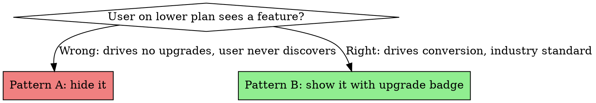
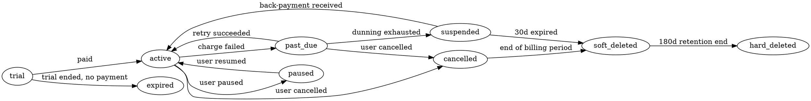
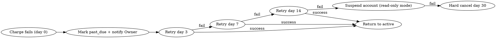

# SaaS Plan Gating + Billing

You are designing the monetization layer of a multi-tenant SaaS. This is where most SaaSes leak revenue (features that should be paid for are free) or kill conversion (features hidden so users don't even know they exist). This skill captures the gating + billing pattern that works for B2B SaaS in LatAm and similar markets.

**Origin:** A Laravel SaaS that started fully free, then retrofitted 3 plan tiers, gating ~40 features, integrating Wompi (Colombian payment gateway), surviving real PCI requirements, dunning failed payments, and supporting 9 subscription states. The PR sequence took 50+ commits across 8 phases. **Doing this with the pattern from day 1 takes 1 phase.**

## When to use this skill

Activate this skill when:
- Pricing the SaaS (deciding which features belong to which tier)
- Adding a feature that should be gated by plan
- Implementing caps (max users, max branches, max products, max emails/month)
- Integrating a payment gateway
- Designing the dunning flow for failed payments
- Receiving webhooks from a payment provider
- Building the SuperAdmin billing console
- Wondering "should I hide this feature for Basic users or show it locked?"

## The 2 fundamental decisions

### Decision 1: Pattern A (hide) vs Pattern B (show + lock)



**Doctrine: Pattern B everywhere.** Locked features are VISIBLE with an "Upgrade to Pro" badge, click reveals what the feature does + upgrade CTA. This is industry-standard B2B SaaS (HubSpot, Linear, Notion, Pipedrive — all do Pattern B).

Pattern A (hiding) destroys two valuable things:
- **Discovery**: user doesn't know what they're missing, can't be convinced to upgrade
- **Trust**: feels like a bait-and-switch when they upgrade and discover a feature they didn't know existed

### Decision 2: Feature flag vs Numeric cap

Some gates are **boolean** ("Multi-location: yes/no"), others are **numeric** ("Max branches: 1/5/unlimited"). Both go in the same `plans` table but are checked by different services:

| Gate type | Example | Checker | Where checked |
|---|---|---|---|
| Boolean feature flag | `multi_location`, `loyalty_program`, `advanced_reports` | `FeatureGate::allows('multi_location')` | Routes, controllers, UI |
| Numeric cap | `max_branches`, `max_users`, `max_emails_per_month` | `UsageTracker::canCreate('branch')` | Service layer, just before persisting |

## The plans table — schema

```php
Schema::create('plans', function (Blueprint $table) {
    $table->id();
    $table->string('slug')->unique();              // 'basic' | 'pro' | 'enterprise'
    $table->string('name');                        // user-visible name
    $table->unsignedInteger('price_monthly_cents');
    $table->unsignedInteger('price_yearly_cents');
    $table->string('currency', 3)->default('USD');

    // Boolean feature flags (one column per flag — verbose but explicit)
    $table->boolean('multi_location')->default(false);
    $table->boolean('loyalty_program')->default(false);
    $table->boolean('advanced_reports')->default(false);
    $table->boolean('custom_branding')->default(false);
    $table->boolean('api_access')->default(false);

    // Numeric caps (nullable = unlimited)
    $table->unsignedInteger('max_branches')->nullable();
    $table->unsignedInteger('max_users')->nullable();
    $table->unsignedInteger('max_products')->nullable();
    $table->unsignedInteger('max_emails_per_month')->nullable();

    $table->timestamps();
});
```

**Why one column per feature flag (not a JSON column)**: it's queryable (`Plan::where('multi_location', true)`), introspectable, and migration-friendly. JSON columns become "what flags are even defined?" mysteries fast.

## FeatureGate — the boolean check

```php
namespace App\Services\Billing;

final class FeatureGate
{
    public static function allows(string $feature): bool
    {
        $tenant = app()->bound('current_tenant') ? app('current_tenant') : null;
        if (! $tenant) return false;

        $plan = $tenant->activeSubscription()?->plan;
        if (! $plan) return false;

        return (bool) $plan->{$feature};
    }
}
```

Usage:

```php
// Controller
if (! FeatureGate::allows('multi_location')) {
    return back()->withErrors(['plan' => 'Multi-location requires Pro plan.']);
}
```

```php
// Middleware (preferred for whole-route gates)
Route::middleware(['auth', 'feature:multi_location'])->group(function () {
    Route::resource('branches', BranchController::class);
});
```

```vue
<!-- Vue UI -->
<button v-if="$page.props.billing.features.multi_location" @click="addBranch">
  Add Branch
</button>
<UpgradeBadge v-else feature="multi_location" />
```

## EnsureFeatureAllowed middleware

```php
namespace App\Http\Middleware;

final class EnsureFeatureAllowed
{
    public function handle(Request $request, Closure $next, string $feature)
    {
        abort_unless(FeatureGate::allows($feature), 403, "This feature requires a higher plan.");
        return $next($request);
    }
}
```

Registered: `'feature' => \App\Http\Middleware\EnsureFeatureAllowed::class`.

## UsageTracker — the numeric cap check

```php
namespace App\Services\Billing;

final class UsageTracker
{
    private const RESOURCE_MAP = [
        'branch'  => ['model' => Branch::class, 'cap' => 'max_branches'],
        'user'    => ['model' => User::class,   'cap' => 'max_users',    'scope' => 'viaTenantPivot'],
        'product' => ['model' => Product::class,'cap' => 'max_products'],
    ];

    public static function canCreate(string $resource): bool
    {
        $tenant = app('current_tenant');
        $plan = $tenant->activeSubscription()?->plan;
        if (! $plan) return false;

        $config = self::RESOURCE_MAP[$resource] ?? null;
        if (! $config) return false;

        $cap = $plan->{$config['cap']};
        if ($cap === null) return true; // unlimited

        $current = self::countCurrent($resource, $tenant, $config);
        return $current < $cap;
    }

    public static function remaining(string $resource): ?int
    {
        // ... returns null for unlimited, otherwise (cap - current)
    }
}
```

**Use it just before persisting**:

```php
public function store(Request $request)
{
    abort_unless(UsageTracker::canCreate('branch'), 422,
        'Branch limit reached for your plan. Upgrade to add more.');
    // ... create branch
}
```

## Silent caps — for limits the user shouldn't see fail

Some caps should "soft-fail" — e.g. email cap. Sending an email when capped shouldn't show an error to the customer; it should silently suppress and log.

```php
public function sendOrderConfirmation(Order $order): void
{
    if (! UsageTracker::canConsume('email')) {
        logger()->info('Email cap reached, suppressing order confirmation', [
            'tenant_id' => $order->tenant_id,
            'order_id' => $order->id,
        ]);
        return; // silent
    }
    Mail::to($order->customer)->send(new OrderConfirmation($order));
    UsageTracker::increment('email');
}
```

The tenant Owner sees a banner: "You've used 950 of 1000 emails this month. Upgrade for unlimited." But individual order flows don't break.

## Paywall preview — show feature, gate on action

For features that are visible-but-locked (Pattern B), the preview flow:

1. User clicks "Multi-location" tab
2. Page renders the actual UI but interactions are intercepted
3. Click on "Add Branch" → modal: "Multi-location is a Pro feature. Here's what you get:" + bullet list + Upgrade CTA
4. NOT a 403 page — that breaks the UX

```vue
<template>
  <div :class="{ 'pointer-events-none opacity-60': !hasFeature }">
    <h2>Multi-Location</h2>
    <!-- actual UI rendered for preview -->
    <BranchList :branches="exampleBranches" />
  </div>
  <PaywallOverlay v-if="!hasFeature" feature="multi_location" />
</template>
```

`PaywallOverlay` is a fixed-position card that explains the feature + Upgrade button.

## Subscription state machine — 9 states

Subscriptions have a lifecycle. Don't use a `boolean is_active` — use a typed enum with valid transitions enforced by a State class:



```php
enum SubscriptionStatus: string {
    case Trial = 'trial';
    case Active = 'active';
    case PastDue = 'past_due';
    case Paused = 'paused';
    case Cancelled = 'cancelled';
    case Expired = 'expired';
    case Suspended = 'suspended';
    case SoftDeleted = 'soft_deleted';
    case HardDeleted = 'hard_deleted';
}
```

Each state has different allowed operations (`canCharge()`, `canCancel()`, `canResume()`). **Use the State pattern** (see `laravel-saas-architecture-decisions`) — `if ($subscription->status === 'active')` everywhere is a smell.

## Payment gateway integration — Strategy + Pro-grade

**Always Strategy pattern**: interface + Fake + Real (see `laravel-saas-architecture-decisions`).

```php
interface PaymentGatewayInterface {
    public function charge(ChargeData $data): ChargeResult;
    public function refund(string $transactionId, int $amountCents): RefundResult;
    public function tokenize(CardData $card): TokenResult;
    public function verifyWebhookSignature(string $payload, string $signature): bool;
}

final class WompiGateway implements PaymentGatewayInterface { /* real HTTP */ }
final class FakeGateway implements PaymentGatewayInterface { /* test doubles with force flags */ }
```

**Pro-grade requirements** (apply ALL):
- `declare(strict_types=1);` on every file
- `#[\SensitiveParameter]` on `card_number`, `cvv`, `api_secret`, `webhook_secret`
- `__debugInfo()` on `CardData`, `ChargeData` DTOs to prevent token leak in stack traces
- Encrypted Eloquent cast on `card_token`, `gateway_customer_id`
- `$hidden` in model serialization
- `IdempotencyService` — every charge/refund has a unique `idempotency_key` stored with UNIQUE constraint
- `CircuitBreaker` — `gateway:auth` and `gateway:api` are separate keys (auth outage doesn't suspend payments)
- `logException()` helper logs only `error_class`, `error_message`, `correlation_id` — NEVER response body

## Webhook receiver — the canonical pattern

When the gateway POSTs a webhook to your endpoint (`transaction.updated`, `transaction.refunded`, `chargeback`):

```php
public function handle(Request $request)
{
    // 1. Verify HMAC signature (production-grade — never skip)
    $signature = $request->header('X-Wompi-Signature');
    $payload = $request->getContent();
    if (! $this->gateway->verifyWebhookSignature($payload, $signature)) {
        abort(401);
    }

    // 2. Idempotency check — same event ID twice = no-op
    $event = json_decode($payload, true);
    $eventId = $event['id'];
    if (WebhookEvent::where('event_id', $eventId)->exists()) {
        return response()->noContent(); // already processed
    }
    WebhookEvent::create(['event_id' => $eventId, 'received_at' => now()]);

    // 3. Dispatch to queue — webhooks must respond <2s
    ProcessGatewayWebhookEvent::dispatch($eventId, $event);

    return response()->noContent();
}
```

The job (`ProcessGatewayWebhookEvent`) does the actual work asynchronously. Webhook receivers must respond fast (gateways retry on timeout, causing duplicates).

## Dunning — handling failed payments

When a recurring charge fails:



Build:
- `DunningService` — orchestrator that runs daily via cron
- `ProcessRecurringChargesCommand` — handles current-day renewals
- `RetryDunningCommand` — retries past-due on day 3/7/14
- `SuspendOverdueSubscriptionsCommand` — flips to suspended after final retry
- Notification templates for each step

## Notifications — multi-channel

Subscription events trigger notifications via:
- **Email** (Resend, SES, Postmark) — for transactional confirmations
- **WhatsApp link** (build a wa.me URL with pre-filled text) — for LatAm where WhatsApp is the default channel

7 notification templates minimum:
1. Trial ending (3 days before)
2. Charge succeeded
3. Charge failed (with retry CTA)
4. Subscription suspended
5. Subscription resumed
6. Subscription cancelled (confirmation)
7. Invoice PDF (attached)

## Pricing page on the marketing site

The pricing page must **match exactly** what the gating code enforces. Build a `PricingMatrix` doc/component that lists every feature and its plan availability — keep it in sync via:

- Single source: `docs/PLAN_FEATURE_MATRIX.md`
- The doc lists every feature flag + every numeric cap + which plan gets what
- Generated comparison table renders on `/pricing` from the same source
- CI grep checks: every feature in the matrix has a `FeatureGate::allows(...)` call somewhere; every gate has a row in the matrix

Misalignment between pricing page and gating code is the #1 source of customer support tickets.

## SuperAdmin billing console

The SaaS operator (you) needs a dashboard to:
- See MRR (Monthly Recurring Revenue)
- See churn rate
- See conversion (trial → paid)
- See plan distribution
- Manually trigger actions: refund, extend trial, force-renew, suspend
- View any tenant's invoices

`SuperAdmin/BillingController` with strict gate (`is_super_admin = true`). Never expose this to regular admins.

## Tests — non-negotiable for billing

### Unit tests
- Every SubscriptionState transition (valid + invalid)
- `FeatureGate::allows()` for every flag
- `UsageTracker::canCreate()` for every resource

### Feature tests
- Trial → paid conversion
- Charge succeeded webhook → subscription marked active
- Charge failed webhook → past_due, dunning email sent
- Refund webhook → balance adjusted, notification sent
- Chargeback webhook → audit log entry, owner notified
- Idempotency: replay webhook → no double-effect

### Security tests
- Webhook HMAC bypass attempts → 401
- Idempotency key bypass attempts → 409
- Super admin gate bypass → 403
- Token expiry → 401
- Cross-tenant billing data leak attempts → 404

### PCI smoke tests
- `#[\SensitiveParameter]` is present on every sensitive param (reflection-based check)
- Throwing an exception that contains a token → token does NOT appear in `getTrace()` / `__toString()` / `serialize()` / `print_r()`
- `Log::shouldReceive('error')` confirms the body is NEVER logged even when HTTP fails

## Operational doc — RUNBOOK

Ship `docs/billing/RUNBOOK.md` covering:
- How to handle a failed reconciliation (Wompi says X, our DB says Y)
- How to manually refund (SuperAdmin action)
- How to enable maintenance mode (suspend cron + webhook processing during DB migrations)
- How to rotate webhook secrets
- How to debug a stuck subscription (state diagram, common DB queries)
- Alerting thresholds (failed charge rate > 5% = page on-call)

## Anti-patterns — never do this

- Hiding locked features (Pattern A) — kills conversion
- Storing card data in your DB (PCI nightmare) — always use the gateway's tokenization
- Catching gateway exceptions without checking the error code (`declined` vs `network_error` need different handling)
- Throwing `$response->body()` into an exception — leaks token if body contained it
- Single shared `idempotency_key` across charge + refund — separate keys per operation type
- Trusting the webhook payload without HMAC verification
- Storing webhook secret in code instead of `.env`
- Running webhook processing in the same HTTP request as the webhook receipt (must be queued, < 2s response)
- One global Circuit Breaker for all gateway calls — separate per endpoint type
- Hardcoded plan slugs in the gating logic (`if ($plan->slug === 'pro')` — what if you rename?) — use feature flags instead
- Forgetting that Webhooks can arrive out-of-order — handle `transaction.updated` after `transaction.refunded` gracefully

## Cross-references

- `laravel-saas-multi-tenant-foundation` — tenant scope this builds on
- `laravel-saas-architecture-decisions` — when pro-grade standards apply (billing is the canonical case)
- `laravel-saas-auth-granularity` — Owner-only billing access, SuperAdmin gate
- `saas-testing-dual-layer` — billing tests + PCI smoke tests
- `vue-inertia-frontend-system` — Paywall preview UI, UpgradeBadge component
