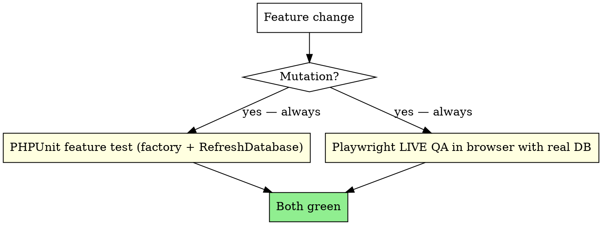
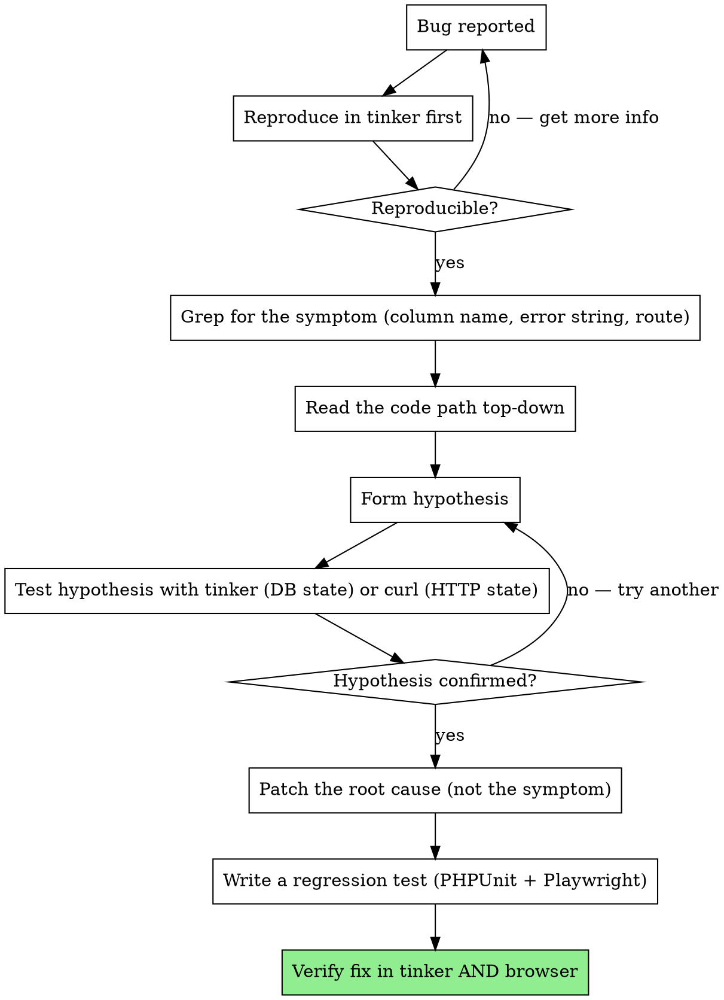

# SaaS Testing — Dual Layer (PHPUnit + Playwright)

You are designing or executing the testing strategy for a Laravel SaaS. The single most-violated rule that causes prod bugs is **skipping live QA in favor of "the unit test passes"**. This skill captures the dual-layer discipline that catches the bugs unit tests cannot.

**Origin:** A Laravel SaaS that had ~1000 PHPUnit tests passing but shipped a printer-config bug to prod because the controller validation expected `kitchen.connection_type` but the frontend sent `connection_type` (flat). The PHPUnit test mocked the request payload to match the controller's expectation. **Playwright in the real browser caught it immediately.** Lesson: **the test that runs the actual production stack is the test that matters.**

## The doctrine



**No exceptions for "small fixes."** A 1-line config change can still break the UI. Run both.

## When PHPUnit alone is enough

- Domain logic (states, helpers, value objects, calculations)
- Repository / service classes with no UI surface
- Internal commands (artisan jobs that have no human consumer)
- Pure backend integrations without user-facing flow

## When Playwright is non-negotiable

- Any new endpoint with a form on it
- Any UI change to a form, modal, slideover, or wizard
- Anti-tampering / authorization gates (verify the button isn't there for Manager)
- Multi-step flows (signup wizard, checkout, refund)
- Multi-tab interactions (POS + KDS, settings + branch switcher)
- Cross-role flows (Owner creates X, Manager sees Y)
- Anything that ships to production this week

## PHPUnit feature test — canonical multi-tenant setup

The hardest part of multi-tenant tests is setting up the context correctly. This boilerplate works:

```php
namespace Tests\Feature\YourModule;

use App\Enums\SubscriptionStatus;
use App\Enums\UserRole;
use App\Models\Branch;
use App\Models\Plan;
use App\Models\Subscription;
use App\Models\Tenant;
use App\Models\User;
use Illuminate\Foundation\Testing\RefreshDatabase;
use Tests\TestCase;

final class YourFeatureTest extends TestCase
{
    use RefreshDatabase;

    /**
     * Set the current tenant + branch in the container. Required for global scopes.
     * NOTE: when making HTTP calls, ALSO use ->withSession(['tenant_id' => ...]),
     * because TenantMiddleware overrides the container binding during the request.
     */
    private function setContext(Tenant $tenant, Branch $branch): void
    {
        app()->instance('current_tenant', $tenant);
        app()->instance('current_branch', $branch);
        \Illuminate\Support\Facades\Cache::flush();
    }

    /**
     * Attach a plan to a tenant — needed for feature gates and billing assertions.
     */
    private function attachPlan(Tenant $tenant, string $planSlug = 'enterprise'): void
    {
        $this->seed(\Database\Seeders\PlanSeeder::class);
        $plan = Plan::where('slug', $planSlug)->first();
        Subscription::factory()->create([
            'tenant_id' => $tenant->id,
            'plan_id' => $plan->id,
            'status' => SubscriptionStatus::Active,
        ]);
    }

    /**
     * Create an Owner — admin with NO branch assignments.
     */
    private function makeOwner(Tenant $tenant): User
    {
        $owner = User::factory()->create(['role' => UserRole::Admin]);
        $owner->tenants()->attach($tenant->id, ['role' => UserRole::Admin->value]);
        return $owner;
    }

    /**
     * Create a Branch Manager — admin assigned to specific branches.
     */
    private function makeManager(Tenant $tenant, Branch $branch): User
    {
        $manager = User::factory()->create(['role' => UserRole::Admin]);
        $manager->tenants()->attach($tenant->id, ['role' => UserRole::Admin->value]);
        $manager->branches()->attach($branch->id, ['tenant_id' => $tenant->id]);
        return $manager;
    }
}
```

### The `withSession()` trap

When the test makes an HTTP call (`$this->actingAs($owner)->post('/orders', ...)`), Laravel runs the full middleware stack including TenantMiddleware. TenantMiddleware **overrides** `app('current_tenant')` based on the session, **not** the container instance you set in `setContext()`.

If your test sets the container but doesn't set the session, the HTTP call will resolve `current_tenant` differently than your test setup.

**Fix**: when making HTTP calls in multi-tenant tests, set both:
```php
$response = $this->actingAs($owner)
    ->withSession([
        'tenant_id' => $tenant->id,
        'current_branch_id' => $branch->id,
    ])
    ->post('/orders', $payload);
```

### The `withoutGlobalScopes()` need

Cross-tenant assertions (e.g. "Tenant B's row should NOT exist for Tenant A but SHOULD still exist in the DB") need to query without the tenant global scope:

```php
$this->assertNotNull(
    Subscription::withoutGlobalScopes()
        ->where('id', $tenantBSubscription->id)
        ->first(),
    'Tenant B subscription must remain intact when Tenant A deletes theirs'
);
```

Without `withoutGlobalScopes()`, the query would return null (filtered by Tenant A scope) and your test would assert the row is "gone" when it isn't.

## The MultiTenantIsolation security test (obligatory)

Every business module needs `tests/Security/<Module>MultiTenantIsolationTest.php` with these 10 scenarios:

```php
public function test_tenant_a_cannot_list_tenant_b_records_via_index() { ... }
public function test_tenant_a_cannot_show_tenant_b_record_by_id_404() { ... }
public function test_tenant_a_cannot_update_tenant_b_record() { ... }
public function test_tenant_a_cannot_delete_tenant_b_record() { ... }
public function test_tenant_a_cannot_create_record_under_tenant_b() { ... }
public function test_url_parameter_manipulation_returns_404_not_leak() { ... }
public function test_search_filter_respects_tenant_scope() { ... }
public function test_aggregations_do_not_sum_across_tenants() { ... }
public function test_soft_deleted_records_do_not_leak_across_tenants() { ... }
public function test_super_admin_can_access_all_tenants_through_explicit_gate() { ... }
```

For multi-location, add a similar suite scoped by `branch_id`.

## Anti-mock dogma

You will be tempted to mock the database, HTTP client, or queue. **Resist.**

**The rule**: integration tests run against the real stack (real DB, real Queue::fake() acceptable, real Mail::fake() acceptable, real Http::fake() for external HTTP). The "Fake" classes provided by Laravel are **deterministic test doubles, not mocks** — they record calls and assert against them, but they don't replace the runtime.

### When mocking is genuinely needed

- External HTTP calls (use `Http::fake()` — built-in)
- External SDK clients you don't own (use a Strategy Fake — see `laravel-saas-architecture-decisions`)
- Time (use `Carbon::setTestNow()` — never mock `Carbon` itself)
- Random / UUID generation (use `Str::createUuidsUsing(...)` — built-in)

### When mocking is a smell

- Mocking your own Repository (just use `RefreshDatabase` and real Eloquent)
- Mocking your own Service (test the service's behavior, not its interface)
- Mocking Eloquent (you're testing Laravel, not your code)
- Mocking DB connections (you're testing your DB driver, not your code)

### Why the dogma

A Laravel SaaS lost a quarter to a mock-passes-prod-fails bug: tests mocked the DB to return a certain shape, but the real migration changed the column type. The mocks didn't know. **Mocks lie quietly. Real integrations fail loudly.**

## Playwright MCP — live QA

When you have Claude Code with the Playwright MCP, you can drive a real browser. Use it for every UI mutation.

### Live QA recipe (always)

1. Verify the app + Vite are running:
```bash
curl -s -o /dev/null -w "%{http_code}\n" http://localhost:81
curl -s -o /dev/null -w "%{http_code}\n" http://localhost:5173/@vite/client
```
Both must be 200.

2. Identify a real test tenant + user:
```bash
./vendor/bin/sail artisan tinker --execute="
  echo App\Models\User::whereHas('tenants', fn(\$q) => \$q->where('tenants.id', 3))
    ->where('users.role', 'admin')
    ->whereDoesntHave('branches', fn(\$q) => \$q->where('branches.tenant_id', 3))
    ->first()?->email;
"
```

3. Navigate, snapshot, interact:
```js
mcp.browser_navigate('http://localhost:81/login');
mcp.browser_evaluate(`() => {
  document.querySelector('input[name="email"]').value = 'owner@test.local';
  document.querySelector('input[name="password"]').value = 'password';
}`);
mcp.browser_click({ target: 'button[type="submit"]', element: 'Submit login' });
mcp.browser_wait_for({ time: 2 });
mcp.browser_navigate('http://localhost:81/settings/printers');
mcp.browser_snapshot();
```

4. Verify the DB after the UI action:
```bash
./vendor/bin/sail artisan tinker --execute="
  echo App\Models\PrinterSettings::withoutGlobalScopes()
    ->where('tenant_id', 3)->where('branch_id', 4)->first()?->ip_address;
"
```

### Live QA scenarios (minimum for any settings flow)

1. **No state**: feature works on a fresh tenant with no data
2. **Normal state**: feature works on a tenant with realistic data (3-5 rows)
3. **Edge state**: feature handles empty arrays, null FKs, soft-deleted rows
4. **Cross-role**: Owner can do it, Manager can do it (or 403), Employee can do it (or 403)
5. **Cross-tenant**: switching tenants doesn't leak the previous tenant's data on screen

### Snapshot vs Screenshot

- **Snapshot** = accessibility tree (text + roles + refs). USE FOR ACTIONS. It's small, deterministic, captures semantic state.
- **Screenshot** = PNG image. USE FOR EVIDENCE in QA reports. Large but visually verifiable.

`browser_take_screenshot` to save a permanent artifact for the QA report. `browser_snapshot` to interact and inspect.

### Pre-existing dev environment gotchas

Before debugging a UI issue, **always check**:

```bash
# 1. Is Vite running and hot-reloading?
ls -la public/hot && curl -s http://localhost:5173/@vite/client | head -2

# 2. Are the containers up?
docker ps --format "table {{.Names}}\t{{.Status}}" | grep -v Exited

# 3. Is APP_URL matching the actual reachable URL?
grep APP_URL .env

# 4. Is the user logged in correctly?
mcp.browser_evaluate(`() => JSON.parse(document.getElementById('app').dataset.page).props.auth.user.email`)
```

90% of "UI broken" reports are one of: stale Vite, dead container, wrong APP_URL.

## Verify-don't-assume workflow (critical)

When debugging a bug:



**Specific anti-patterns to AVOID**:
- Patching a symptom in the UI when the bug is in the controller validation
- "It works on my machine" without running the same commands in tinker
- Assuming an enum cast is `'kg'` when the DB has `'Kg'` (verify with `DESCRIBE table` or model `$casts`)
- Assuming a status is in English (`'paid'`) when the DB has Spanish (`'pagado'`)
- Skipping a fresh `npm run build` after pulling a Vue refactor

When in doubt: **tinker, grep, read, hypothesize, verify, patch, test.** The shortcut is to skip the verify step. Don't.

## Test data — never reuse production-like dumps

Use factories for **everything**. A bug fix verified against a dump from prod is a bug fix that's hard to re-verify months later when the dump is gone.

Factory checklist for multi-tenant models:
- `UserFactory::create()` returns a user with no tenant attached. Test code calls `->tenants()->attach($tenantId, [...])` explicitly.
- `TenantFactory::create()` auto-creates the default branch via `Tenant::booted()`.
- Business model factories (Order, Product, etc.) should pull tenant + branch from `app('current_tenant')` / `app('current_branch')` if set — but **fail loudly** (throw) if not set, instead of silently picking tenant 1.

```php
class OrderFactory extends Factory
{
    public function definition(): array
    {
        $tenant = app()->bound('current_tenant') ? app('current_tenant') : null;
        if (! $tenant) {
            throw new \LogicException('OrderFactory requires current_tenant binding. Use setContext() in your test.');
        }
        return [
            'tenant_id' => $tenant->id,
            'branch_id' => app()->bound('current_branch') ? app('current_branch')->id : null,
            // ...
        ];
    }
}
```

This catches the "I forgot to set tenant context" bug at factory time, not at DB-constraint time.

## Anti-patterns — never do this

- Skipping live QA "because the PHPUnit passes" — that's how you ship to prod and find out
- Mocking Eloquent or the DB ("DB::shouldReceive") — you're testing Laravel, not your code
- Writing a regression test AFTER fixing the bug "to save time" — you'll forget to do it, ship without the regression coverage
- Hardcoding `tenant_id => 1` in any factory or test
- Using `Auth::user()->tenant_id` — there's no `tenant_id` column on `users` (many-to-many)
- Test data leaking between tests because you didn't `RefreshDatabase`
- Calling `$this->actingAs($user)` without also setting the tenant context — middleware will resolve a different tenant than you set up
- Asserting only HTTP status without asserting DB state (false-green: 200 but the row wasn't actually created)
- Forgetting `withoutGlobalScopes()` in cross-tenant assertions — your "tenant B's row gone" assertion is a false positive (it's just filtered)
- Snapshotting at the wrong viewport — a mobile bug isn't visible at 1920×1080. Test 375×667 too.

## Cross-references

- `laravel-saas-multi-tenant-foundation` — the tenant/branch context setup this builds on
- `laravel-saas-auth-granularity` — anti-escalation test scenarios
- `laravel-saas-settings-architecture` — settings tests use the lenient resolver pattern
- `saas-plan-gating-billing` — pro-grade tests for billing modules (reflection + smoke + Http::fake)
- `vue-inertia-frontend-system` — Playwright snapshot patterns for Vue 3 + Inertia
