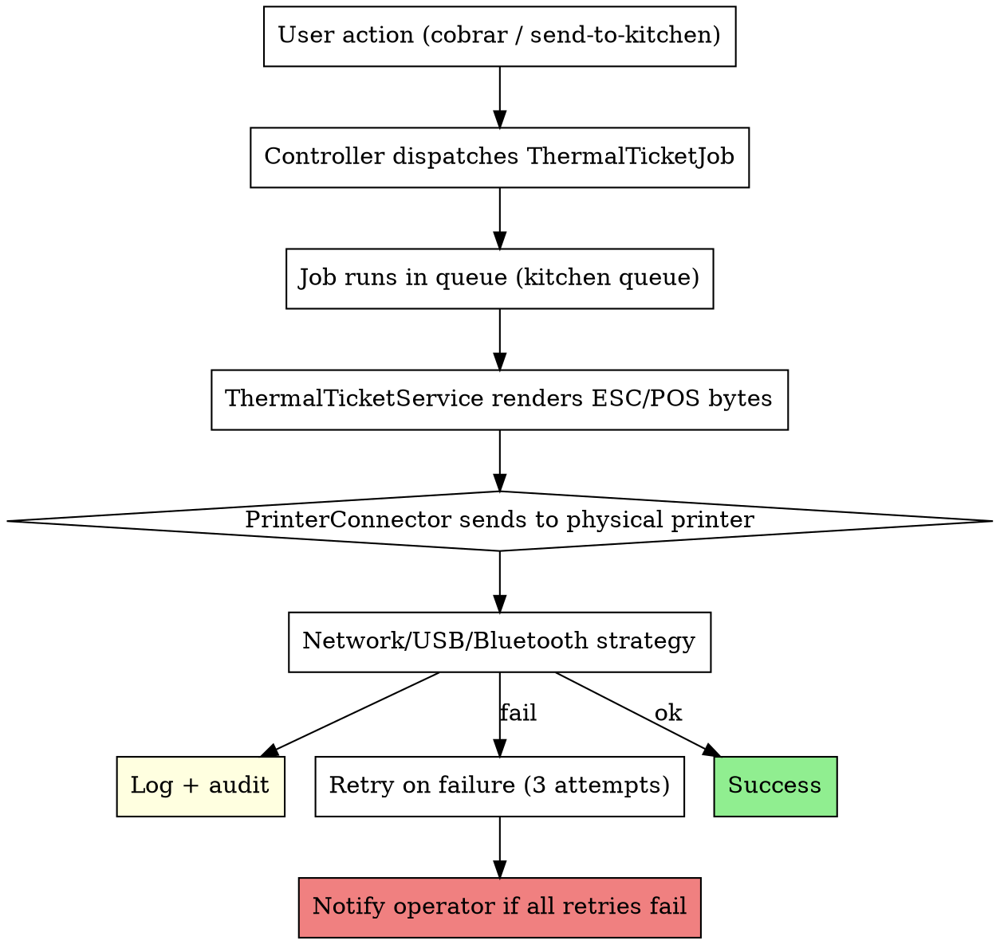

# SaaS Thermal Printing Pipeline

You are integrating thermal receipt printers into a SaaS. **Printing is unreliable IO** — the printer might be off, out of paper, network might flap, or USB might disconnect. If your code blocks on print, your POS hangs at checkout. This skill captures the async + retry + observable pipeline that survived a real restaurant SaaS with 3 printer types (kitchen, customer, returns) across multiple branches.

**Origin:** A restaurant POS where the first version had `Print::send($ticket)` synchronously in the checkout controller. When the printer was off, the POS hung for 60 seconds, the cashier panicked, and double-charged. This skill is the fix.

## When to use this skill

Activate when:
- Adding receipt / ticket / label printing to a SaaS
- POS, KDS (Kitchen Display System), or any order-fulfillment flow that ends in paper
- Returns / refunds that print a receipt
- Quotations / invoices that print to a thermal printer
- Multi-location: each branch has its own printer(s)

## The architecture



**The 3 critical principles**:
1. **Async**: never block the user on print. Always queue.
2. **Retried**: transient failures (network blip, printer warming) retry; permanent failures (no paper, no printer) notify.
3. **Observable**: every print attempt logged with tenant/branch/printer/correlation ID.

## Dependencies

Use `mike42/escpos-php` (mature, widely used):
```bash
composer require mike42/escpos-php
```

For Bluetooth: depends on OS-level config + a daemon (`bluetoothctl` on Linux). Skip if you don't need it.

## The 3 connector strategies

```php
namespace App\Services\Printing\Connectors;

interface PrinterConnectorInterface
{
    public function open(): void;
    public function write(string $bytes): void;
    public function close(): void;
}

final class NetworkPrinterConnector implements PrinterConnectorInterface
{
    public function __construct(
        private readonly string $ipAddress,
        private readonly int $port = 9100,
        private readonly int $timeout = 5,
    ) {}

    public function open(): void
    {
        // NetworkPrintConnector from escpos-php uses fsockopen with timeout
        $this->connector = new \Mike42\Escpos\PrintConnectors\NetworkPrintConnector(
            $this->ipAddress,
            $this->port,
        );
    }
    // ...
}

final class UsbPrinterConnector implements PrinterConnectorInterface { /* CUPS / lp */ }

final class BluetoothPrinterConnector implements PrinterConnectorInterface { /* rfcomm */ }

// For local dev — writes to disk instead of network
final class FilePrinterConnector implements PrinterConnectorInterface
{
    public function open(): void { /* noop */ }

    public function write(string $bytes): void
    {
        $path = storage_path('app/tickets/' . now()->format('Ymd_His') . '_' . uniqid() . '.txt');
        // Strip ESC/POS control bytes for human readability in dev
        file_put_contents($path, $this->strip_escpos($bytes));
    }

    public function close(): void { /* noop */ }
}
```

## Connector factory — picks based on env + config

```php
final class PrinterConnectorFactory
{
    public function make(PrinterSettings $settings): PrinterConnectorInterface
    {
        // In local dev, always file (no real printer connected)
        if (app()->environment('local')) {
            return new FilePrinterConnector();
        }

        return match ($settings->connection_type) {
            'network' => new NetworkPrinterConnector($settings->ip_address, $settings->port ?? 9100),
            'usb' => new UsbPrinterConnector($settings->printer_name),
            'bluetooth' => new BluetoothPrinterConnector($settings->printer_name),
            default => throw new \DomainException("Unknown connection type: {$settings->connection_type}"),
        };
    }
}
```

**FakePrinterConnector** for tests — records all writes for assertions:
```php
final class FakePrinterConnector implements PrinterConnectorInterface
{
    public array $writes = [];
    public bool $shouldFail = false;

    public function write(string $bytes): void
    {
        if ($this->shouldFail) throw new PrinterUnavailableException();
        $this->writes[] = $bytes;
    }
    public function open(): void {}
    public function close(): void {}
}
```

## ThermalTicketService — renders the ticket

```php
namespace App\Services\Printing;

use Mike42\Escpos\Printer;
use Mike42\Escpos\PrintConnectors\PrintConnector;

final class ThermalTicketService
{
    public function __construct(private PrinterConnectorFactory $factory) {}

    public function printKitchenTicket(Order $order, PrinterSettings $settings): void
    {
        $connector = $this->factory->make($settings);
        $connector->open();
        $printer = new Printer($connector, $this->profileFor($settings->width_mm));

        try {
            $printer->setJustification(Printer::JUSTIFY_CENTER);
            $printer->setEmphasis(true);
            $printer->setTextSize(2, 2);
            $printer->text("COCINA\n");
            $printer->setTextSize(1, 1);
            $printer->setEmphasis(false);

            $printer->feed(1);
            $printer->setJustification(Printer::JUSTIFY_LEFT);
            $printer->text("Mesa: {$order->table}\n");
            $printer->text("Mesero: {$order->server->name}\n");
            $printer->text("Pedido: #{$order->number}\n");
            $printer->text("Hora: " . now()->format('H:i') . "\n");
            $printer->feed(1);

            $printer->text("--------------------------------\n");
            foreach ($order->items as $item) {
                $printer->setEmphasis(true);
                $printer->text(sprintf("%-3sx %s\n", $item->quantity, $item->name));
                $printer->setEmphasis(false);
                if ($item->note) {
                    $printer->text("    > {$item->note}\n");
                }
            }
            $printer->text("--------------------------------\n");

            $printer->feed(2);
            $printer->cut();
        } finally {
            $printer->close();
            $connector->close();
        }
    }

    public function printCustomerReceipt(Order $order, PrinterSettings $settings): void { /* ... */ }
    public function printReturnReceipt(Refund $refund, PrinterSettings $settings): void { /* ... */ }

    private function profileFor(string $widthMm): \Mike42\Escpos\CapabilityProfile
    {
        // 58mm = 32 chars/line, 80mm = 48 chars/line
        return \Mike42\Escpos\CapabilityProfile::load('default');
    }
}
```

## The Job — queueable + retry + observability

```php
namespace App\Jobs\Printing;

final class PrintKitchenTicketJob implements ShouldQueue
{
    use Dispatchable, InteractsWithQueue, Queueable, SerializesModels;

    public int $tries = 3;
    public int $timeout = 30;
    public array $backoff = [10, 30, 60];

    public function __construct(public Order $order) {}

    public function viaConnection(): string
    {
        return config('queue.default');
    }

    public function viaQueue(): string
    {
        return 'kitchen';  // separate queue → separate worker priority
    }

    public function handle(ThermalTicketService $service): void
    {
        $tenantId = $this->order->tenant_id;
        $branchId = $this->order->branch_id;

        $settings = PrinterSettings::active(); // lenient resolver: branch override → tenant default
        if (! $settings || ! $settings->is_enabled) {
            Log::channel('kitchen')->info('ticket.skipped_disabled', [
                'order_id' => $this->order->id, 'tenant_id' => $tenantId, 'branch_id' => $branchId,
            ]);
            return;  // not an error — printer just disabled for this branch
        }

        Log::channel('kitchen')->info('ticket.dispatched', [
            'order_id' => $this->order->id, 'tenant_id' => $tenantId, 'branch_id' => $branchId,
            'connection_type' => $settings->connection_type,
            'attempt' => $this->attempts(),
        ]);

        try {
            $service->printKitchenTicket($this->order, $settings);

            Log::channel('kitchen')->info('ticket.printed', [
                'order_id' => $this->order->id, 'tenant_id' => $tenantId,
            ]);
        } catch (PrinterUnavailableException $e) {
            Log::channel('kitchen')->warning('ticket.print_failed', [
                'order_id' => $this->order->id,
                'attempt' => $this->attempts(),
                'error' => $e->getMessage(),
            ]);
            throw $e;  // re-queue for retry
        }
    }

    public function failed(\Throwable $e): void
    {
        Log::channel('kitchen')->error('ticket.print_failed_final', [
            'order_id' => $this->order->id,
            'tenant_id' => $this->order->tenant_id,
            'error' => $e->getMessage(),
        ]);

        // Surface to operator: in-app notification, Sentry alert, etc.
        $this->order->tenant->owner()->notify(new PrinterUnavailableNotification($this->order));
    }
}
```

## Per-branch printer config (cross-ref `laravel-saas-settings-architecture`)

```php
Schema::create('printer_settings', function (Blueprint $table) {
    $table->id();
    $table->foreignId('tenant_id')->constrained()->cascadeOnDelete();
    $table->foreignId('branch_id')->nullable()->constrained()->cascadeOnDelete();
    $table->string('type');  // kitchen, customer, returns
    $table->boolean('is_enabled')->default(false);
    $table->string('connection_type');  // network, usb, bluetooth
    $table->ipAddress('ip_address')->nullable();
    $table->unsignedSmallInteger('port')->nullable();
    $table->string('printer_name', 100)->nullable();  // for USB/Bluetooth
    $table->enum('width_mm', ['58', '80'])->default('80');
    $table->boolean('auto_print')->default(true);
    $table->timestamps();
    $table->unique(['tenant_id', 'branch_id', 'type']);
});
```

The `BranchAwareSetting` concern + lenient resolver applies here — see `laravel-saas-settings-architecture` skill.

## Worker config

```bash
# Supervisor config
[program:queue-worker-kitchen]
command=php /var/www/artisan queue:work --queue=kitchen,mail,default --tries=3 --timeout=90
autostart=true
autorestart=true
numprocs=2
user=www-data
redirect_stderr=true
stdout_logfile=/var/log/laravel/queue-kitchen.log
```

**Critical**: include `kitchen` in the `--queue` flag. Forgetting this → tickets never print, emails never send.

## Log channel `kitchen`

```php
// config/logging.php
'kitchen' => [
    'driver' => 'daily',
    'path' => storage_path('logs/kitchen/kitchen.log'),
    'level' => 'info',
    'days' => 14,
    'permission' => 0600,
],
```

Events logged: `ticket.dispatched`, `ticket.printed`, `ticket.print_failed`, `ticket.print_failed_final`, `ticket.skipped_disabled`, `reprint.success`, `reprint.failed`, `cancellation`.

## Reprint endpoint (operator action)

Sometimes the printer was off and the ticket failed silently. Provide a "Reprint" button in the Orders view:

```php
public function reprint(Order $order): RedirectResponse
{
    $this->authorize('reprint', $order);
    PrintKitchenTicketJob::dispatch($order);

    Log::channel('kitchen')->info('reprint.requested', [
        'order_id' => $order->id,
        'user_id' => auth()->id(),
    ]);

    return back()->with('success', 'Reimpresión enviada a cocina.');
}
```

## Dashboard for failed prints (admin visibility)

Build a tab/page that shows tickets in `ticket.print_failed_final` state in the last 7 days:
- Order ID, branch, time of failure, error reason
- "Reprint" action
- "Mark as resolved" action (operator handled manually)
- Counts per branch / per printer to spot patterns ("Walter branch keeps failing → printer broken?")

## Local dev — file storage fallback

When `APP_ENV=local`, `FilePrinterConnector` writes the rendered ticket to `storage/app/tickets/`. Cashiers / devs can inspect the file to verify rendering without a physical printer. **In CI, same fallback** — no real printer needed for tests.

```php
// Test
public function test_kitchen_ticket_is_dispatched_on_order_send_to_kitchen(): void
{
    Queue::fake();

    $order = Order::factory()->create();
    $this->actingAs($order->tenant->owner())->post("/orders/{$order->id}/send-to-kitchen");

    Queue::assertPushed(PrintKitchenTicketJob::class, function ($job) use ($order) {
        return $job->order->id === $order->id;
    });
}

public function test_kitchen_ticket_contents_include_items_and_notes(): void
{
    $fake = new FakePrinterConnector();
    app()->instance(PrinterConnectorFactory::class, $this->mockFactoryReturning($fake));

    (new PrintKitchenTicketJob($order))->handle(app(ThermalTicketService::class));

    $output = implode('', $fake->writes);
    $this->assertStringContainsString('Mesa: 5', $output);
    $this->assertStringContainsString($order->items->first()->name, $output);
}
```

## Auto-print vs manual

Each printer setting has `auto_print` boolean:
- `auto_print=true` → on order send-to-kitchen / cobrar, ticket prints automatically
- `auto_print=false` → operator must press a button per order

Some restaurants prefer manual (slow service, owner wants to review every ticket). Respect both.

## Anti-patterns — never do this

- Calling `Print::send()` synchronously in the checkout controller (blocks user on printer failure)
- Using a single global printer config (multi-branch = multi-printer)
- No retry logic — first failure = permanent failure
- Not logging print attempts — when "tickets aren't printing" reports come in, you can't diagnose
- Forgetting to include `kitchen` queue in worker `--queue` flag (tickets silently never print)
- Using `php artisan queue:listen` instead of `queue:work --tries=3` (listen has no retry)
- Hard-coding network printer IP / port (per-branch config!)
- No FilePrinterConnector for local dev — devs can't test without buying a thermal printer
- Including PII (full credit card number, full customer address) on a kitchen ticket — chef doesn't need it
- Letting `failed()` Job hook do nothing — operator needs to know
- One worker process for everything — kitchen queue should have dedicated workers (priority)
- Printing the ticket from the frontend via WebUSB / WebBluetooth — fragile, browser-locked. Backend dispatches to a printer is the right pattern.

## Setup checklist for new SaaS

- [ ] `composer require mike42/escpos-php`
- [ ] `printer_settings` table migration with `(tenant_id, branch_id, type)` UNIQUE composite
- [ ] `PrinterSettings` model with `BranchAwareSetting` concern
- [ ] `PrinterConnectorInterface` + Network/USB/Bluetooth/File/Fake implementations
- [ ] `PrinterConnectorFactory`
- [ ] `ThermalTicketService` with kitchen + customer + returns templates
- [ ] `PrintKitchenTicketJob` (and equivalents) with retries + `failed()` hook
- [ ] Log channel `kitchen` configured
- [ ] Worker config includes `kitchen` queue
- [ ] Reprint endpoint + UI button
- [ ] Failed-prints admin dashboard
- [ ] Settings UI to configure printer per branch (per `laravel-saas-settings-architecture`)
- [ ] Tests with FakePrinterConnector
- [ ] Smoke test: real printer in staging, send a test ticket, verify paper output

## Cross-references

- `laravel-saas-multi-tenant-foundation` — tenant_id + branch_id scoping
- `laravel-saas-settings-architecture` — per-branch printer override with lenient resolver
- `laravel-saas-architecture-decisions` — Strategy pattern for connectors
- `laravel-design-patterns-toolkit` — Job + Observer + Service patterns
- `saas-testing-dual-layer` — FakePrinterConnector + Queue::fake() patterns
