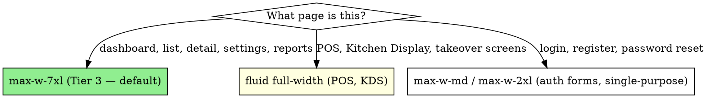

# Vue + Inertia Frontend System

You are building the frontend of a multi-tenant Laravel SaaS using Vue 3 + Inertia 2 + Tailwind 3/4. This skill captures the design system distilled from redesigning a real B2B SaaS twice (~50 Vue files across 10 modules). The constraint: **utility-first Tailwind, no custom CSS, no emojis, dark mode from day 1, mobile-first.**

**Origin:** Two full redesigns to get to a coherent system: first migration auth/onboarding to brand green, second migration of 9 settings tabs + 6 cash register views + 4 inventory views + everything else. Plus the painful realization that emojis in toasts look amateur in a B2B SaaS. **Skipping the system means redesigning a third time.**

## When to use this skill

Activate this skill when:
- Creating a new Vue page or component
- Adding a settings tab
- Building a form, slideover, modal, or wizard
- Adding a table to a list view
- Touching dark mode tokens
- About to write custom CSS (don't — see "no custom CSS" below)
- Tempted to add an emoji to a button or toast (don't — see "no emojis" below)
- Redesigning anything (read "POS is sacred" first)

## Core stack — non-negotiables

| Choice | Why |
|---|---|
| Vue 3 `<script setup>` Composition API | Cleanest TypeScript-friendly API, less boilerplate than Options API |
| Inertia 2 persistent layouts | SPA UX without API, partial reloads, Ziggy routes |
| Tailwind 3 or 4 utility-first | NO custom CSS files. Design tokens in `tailwind.config.js`. Composition over inheritance. |
| Lucide Icons or Heroicons inline SVG | NO emojis. NO icon fonts. Consistent stroke-width, copy-paste. |
| Composition API composables (`useToast`, `useConfirmDialog`, etc.) | Reusable logic without mixins |
| `usePage()` for Inertia shares | NEVER `$page.props.*` directly — use `usePage()` reactively |

## The 3-tier visual hierarchy

Pages fall into one of 3 visual tiers. Don't mix them.

### Tier 1 — Editorial warm (rare, marketing-only)
Used for: landing page, pricing page.
Style: large headlines (Noto Serif), warm cream backgrounds, photographic imagery, generous whitespace, fancy gradients.
Components: `Tier1Hero`, editorial typography helpers.

### Tier 2 — Dark premium (also rare, special flow)
Used for: signup wizard, onboarding, payment flow.
Style: dark panels with bright accents, full-width hero feel, dramatic.

### Tier 3 — Linear / Notion clean (90% of the app — the default)
Used for: dashboards, settings, lists, detail pages, forms.
Style: white/gray-50 background, max-w-7xl containers, soft borders, rounded-2xl cards, generous gaps, dark mode toggle.

**Doctrine: when in doubt, Tier 3.** Don't invent a Tier 4.

## Brand tokens — define ONCE in tailwind.config.js

```js
// tailwind.config.js
module.exports = {
  darkMode: 'class',
  theme: {
    extend: {
      colors: {
        brand: {
          50:  '#ecfdf5',   // emerald-50  (or your brand primary lightest)
          100: '#d1fae5',
          200: '#a7f3d0',
          300: '#6ee7b7',
          400: '#34d399',
          500: '#10b981',   // primary swatch — used for buttons, focus rings
          600: '#059669',
          700: '#047857',
          800: '#065f46',
          900: '#064e3b',
        },
        // Accent (purple for highlights, achievements, etc.)
        accent: { ... },
        // Warning (amber — overrides, "saved only for this branch")
        // Danger (rose — destructive actions)
        // Success / Info (sky)
      },
      fontFamily: {
        sans: ['Plus Jakarta Sans', 'Figtree', 'sans-serif'],
        serif: ['Noto Serif', 'serif'],
      },
    },
  },
};
```

**Doctrine**: every page references `bg-brand-500`, `text-brand-600`, `border-brand-200`. NEVER `bg-[#10b981]` (hardcoded hex). When you want to rebrand, you change `tailwind.config.js`.

## Dynamic theming via CSS variables (multi-tenant brand colors)

If your SaaS lets each tenant pick their brand color (e.g. the storefront / digital menu), use CSS variables alongside the static brand tokens:

```css
/* resources/css/app.css */
:root {
  --theme-primary-500: theme('colors.brand.500');
  --theme-primary-600: theme('colors.brand.600');
}
.theme-tenant-blue {
  --theme-primary-500: #3b82f6;
  --theme-primary-600: #2563eb;
}
```

Then in Vue templates: `class="bg-theme-primary-500"` where you've extended Tailwind to support `theme-primary-*` mapped to the CSS var.

**Critical**: when supporting dynamic theming, override **every** legacy `--brand-*` var alongside the new tokens. QA with high-contrast colors (blue, purple, yellow) to expose hardcoded mismatches.

## The layout container strategy



**`max-w-7xl mx-auto` is the standard container.** Inside it, content uses `space-y-6` between sections.

## The PageHeader pattern

Every Tier 3 page starts with a `PageHeader` component:

```vue
<template>
  <AdminLayout>
    <div class="max-w-7xl mx-auto px-4 sm:px-6 lg:px-8 py-6 space-y-6">
      <PageHeader
        title="Inventory Movements"
        description="Stock entries, exits, adjustments and audits."
        :breadcrumbs="[
          { label: 'Dashboard', href: route('dashboard') },
          { label: 'Inventory', href: route('inventory.index') },
          { label: 'Movements' },
        ]"
      >
        <template #actions>
          <PrimaryButton @click="createMovement">New Movement</PrimaryButton>
        </template>
      </PageHeader>

      <!-- page content -->
    </div>
  </AdminLayout>
</template>
```

PageHeader includes breadcrumbs + title + description + actions slot. **Standard across all Tier 3 pages.** Don't invent a different header layout per module.

## Responsive tables — desktop table + mobile cards

Tables are the most-violated pattern. The rule: **never horizontal scroll on mobile.** Render a `<table>` on desktop and `<div>` cards on mobile, same data.

```vue
<template>
  <!-- Desktop table -->
  <div class="hidden md:block">
    <table class="min-w-full divide-y divide-gray-200">
      <thead>...</thead>
      <tbody>
        <tr v-for="order in orders" :key="order.id">
          <td>{{ order.number }}</td>
          <td>{{ order.total }}</td>
          <td>{{ order.status }}</td>
        </tr>
      </tbody>
    </table>
  </div>

  <!-- Mobile cards -->
  <div class="md:hidden space-y-3">
    <div v-for="order in orders" :key="order.id"
         class="rounded-xl border border-gray-200 dark:border-gray-700 bg-white dark:bg-gray-800 p-4">
      <div class="flex justify-between mb-2">
        <span class="font-semibold">{{ order.number }}</span>
        <span class="text-brand-600">{{ order.total }}</span>
      </div>
      <span class="text-xs text-gray-500">{{ order.status }}</span>
    </div>
  </div>
</template>
```

**Doctrine**: every list page has both. Don't compromise with "just make the table horizontally scrollable." It's bad UX.

## SettingsSection — the reusable card wrapper

For settings pages, use a `SettingsSection` component with optional slots:

```vue
<!-- resources/js/Components/Settings/SettingsSection.vue -->
<script setup>
defineProps({
  title: { type: String, required: true },
  description: { type: String, default: '' },
  padded: { type: Boolean, default: true },
});
</script>

<template>
  <section class="bg-white dark:bg-gray-800 rounded-2xl border border-gray-200 dark:border-gray-700 shadow-sm overflow-hidden">
    <div class="px-5 py-4 border-b border-gray-100 dark:border-gray-700 flex items-start justify-between gap-3">
      <div class="flex-1 min-w-0">
        <div class="flex items-center gap-2 flex-wrap">
          <h3 class="text-sm font-semibold text-gray-900 dark:text-white">{{ title }}</h3>
          <slot name="badge" />
        </div>
        <p v-if="description" class="mt-0.5 text-xs text-gray-500 dark:text-gray-400">{{ description }}</p>
      </div>
      <div class="flex-shrink-0">
        <slot name="actions" />
      </div>
    </div>
    <div :class="padded ? 'p-5' : ''">
      <slot />
    </div>
  </section>
</template>
```

**Three slots**: default (body), `#badge` (status pill next to title), `#actions` (button on the right). This pattern enables the per-branch override badge + revert button without duplicating the SettingsSection wrapper.

## SlideOver pattern — desktop slide-right, mobile bottom-sheet

Modals are bad for forms. SlideOvers are better. A SlideOver:
- On desktop (≥ md): slides in from the right, occupies 480px, leaves the rest of the page visible
- On mobile (< md): slides up from the bottom as a bottom-sheet, occupies 90vh, with a drag handle

Base component `Components/SlideOver.vue`:

```vue
<script setup>
defineProps({
  open: Boolean,
  title: String,
});
defineEmits(['close']);
</script>

<template>
  <Teleport to="body">
    <Transition leave-active-class="duration-200">
      <div v-if="open" class="fixed inset-0 z-50 overflow-hidden">
        <div class="absolute inset-0 bg-gray-900/40 backdrop-blur-sm" @click="$emit('close')" />
        <!-- Desktop: slide from right -->
        <Transition
          enter-from-class="md:translate-x-full" enter-to-class="md:translate-x-0"
          leave-from-class="md:translate-x-0" leave-to-class="md:translate-x-full"
        >
          <div v-if="open"
               class="absolute md:right-0 md:top-0 md:bottom-0 md:w-[480px]
                      bottom-0 left-0 right-0 max-h-[90vh] md:max-h-none
                      rounded-t-2xl md:rounded-t-none md:rounded-l-2xl
                      bg-white dark:bg-gray-800 shadow-xl overflow-y-auto"
          >
            <header class="sticky top-0 bg-white dark:bg-gray-800 px-5 py-4 border-b">
              <div class="flex items-center justify-between">
                <h2 class="font-semibold">{{ title }}</h2>
                <button @click="$emit('close')" aria-label="Close">×</button>
              </div>
            </header>
            <div class="p-5">
              <slot />
            </div>
          </div>
        </Transition>
      </div>
    </Transition>
  </Teleport>
</template>
```

**Doctrine**: use SlideOver for any create/edit form with more than 3 fields. Use Modal only for confirmations (`useConfirmDialog`).

## Composables — the reusable logic layer

Build these composables and use them everywhere:

### `useToast` — one toast notification system

```js
import { ref } from 'vue';
const toasts = ref([]);

export function useToast() {
  return {
    success: (msg) => push({ type: 'success', message: msg }),
    error: (msg) => push({ type: 'error', message: msg }),
    info: (msg) => push({ type: 'info', message: msg }),
  };
}
```

**Single toast on save**. Not 3 (one per form section). If you find yourself dispatching 3 toasts, batch your saves into one POST.

### `useConfirmDialog` — replace `confirm()` native

```js
const { confirm } = useConfirmDialog();
const ok = await confirm({
  type: 'warning',
  title: 'Revert to default?',
  message: 'This branch will inherit the business default and lose its custom value.',
  confirmText: 'Revert',
  cancelText: 'Cancel',
});
if (!ok) return;
```

Awaits a promise that resolves true/false. Renders a styled modal (not the browser's native).

### `useBranchScopeDefault` — intelligent default for the per-branch toggle

Decides the default value of `branchScope`:
- If there's a current override → default to `'this_branch'`
- If current branch is NOT the default → default to `'this_branch'` (anti-trap)
- Otherwise → `'all_branches'`

### `usePullToRefresh` — mobile refresh gesture

For list pages, support pull-to-refresh on mobile (drag down at top of page).

### `useCleanFilters` — strip empty query params before reloading

When applying filters (date range, search, etc.), strip empty values from the query string so the URL stays clean.

## No emojis in B2B UI

This is a hard doctrine. Emojis look unprofessional in a paid B2B SaaS. Replace EVERY emoji with an inline SVG icon from Lucide or Heroicons:

```vue
<!-- WRONG -->
<button>✅ Save changes</button>

<!-- RIGHT -->
<button class="inline-flex items-center gap-2">
  <svg class="w-4 h-4" fill="none" stroke="currentColor" viewBox="0 0 24 24">
    <path stroke-linecap="round" stroke-linejoin="round" stroke-width="2" d="M5 13l4 4L19 7" />
  </svg>
  Save changes
</button>
```

**Sweep**: when starting a new SaaS, grep `\\p{Emoji}` across `resources/js/` BEFORE the first release. Emoji creep is hard to remove later.

## No custom CSS

Tailwind utilities cover 99% of needs. If you find yourself writing:

```css
/* WRONG */
.my-card { padding: 16px; border-radius: 8px; ... }
```

Stop. Use Tailwind utilities directly:

```vue
<!-- RIGHT -->
<div class="p-4 rounded-lg ...">...</div>
```

**The 1% exception**: CSS animations that Tailwind doesn't cover (custom keyframes), or third-party widget overrides. Even then, write them in a single `app.css` file with the smallest possible footprint.

## Dark mode from day 1

Every component renders correctly in both modes. Use Tailwind's `dark:` variant:

```vue
<div class="bg-white text-gray-900 dark:bg-gray-800 dark:text-gray-100">...</div>
```

**The 4 token pairs you'll use most**:

| Surface | Light | Dark |
|---|---|---|
| Page background | `bg-gray-50` | `dark:bg-gray-900` |
| Card background | `bg-white` | `dark:bg-gray-800` |
| Border | `border-gray-200` | `dark:border-gray-700` |
| Body text | `text-gray-900` | `dark:text-gray-100` |
| Muted text | `text-gray-500` | `dark:text-gray-400` |

The dark mode toggle goes in the user menu in the sidebar. Persist preference in localStorage.

## POS is sacred — do NOT redesign

If your SaaS has a high-traffic operational UI (POS, Kitchen Display, dispatch board, agent console), **treat it as immutable** after the first release. Cashiers and operators build muscle memory; changing the layout breaks productivity.

**Allowed changes to POS**: bug fixes, performance improvements, cosmetic token shifts (e.g. updating brand color when re-themed) **with owner approval**.

**Forbidden changes**: restructuring the layout, moving buttons, changing keyboard shortcuts, adding more fields to the main view. New features go in slideovers or secondary tabs.

This doctrine saved POSLatam from a "we're redesigning the POS" disaster proposed by an external designer who'd never run a shift.

## The Inertia 2 shares (canonical)

Every Inertia request has these shares in `props`:

```js
const page = usePage();
page.props.auth.user              // { id, name, email, role }
page.props.current_tenant         // { id, name, slug }
page.props.current_branch         // { id, name, slug, is_default }
page.props.user_branches          // Array<{ id, name, is_default }>
page.props.user_capabilities      // { is_super_admin, is_owner, is_branch_manager, can_see_all_branches }
page.props.billing.features       // { multi_location: true, advanced_reports: false, ... }
page.props.flash                  // { success, error, info } from session
```

Access them via `usePage()`:
```vue
<script setup>
import { computed } from 'vue';
import { usePage } from '@inertiajs/vue3';

const page = usePage();
const isOwner = computed(() => page.props.user_capabilities?.can_see_all_branches);
</script>
```

**NEVER** `$page.props.x` in templates — it bypasses reactivity in setup.

## Ziggy routes — global `route()` helper

Ziggy exposes Laravel routes to JS. Use it everywhere:

```vue
<Link :href="route('orders.index', { branch: currentBranchSlug })">Orders</Link>

<form @submit.prevent="router.post(route('settings.printers.update'), form.value)">
```

NEVER hardcode URLs (`/settings/printers`) — they break when routes change.

## Performance hygiene (Inertia partial reloads)

When a form save should only refresh one section of the page, use partial reloads:

```js
router.post(route('settings.printers.update'), payload, {
  preserveScroll: true,
  only: ['printerSettings', 'flash'],  // only re-fetch these props
});
```

Tells Inertia to skip re-rendering everything. Cuts payload + paint time substantially on long pages.

## Anti-patterns — never do this

- Writing custom CSS in a `.scss` file instead of Tailwind utilities
- Adding emojis to toasts, buttons, or page titles in a B2B UI
- Using modals for forms with >3 fields (use SlideOver)
- 3 toasts on one save (batch into one POST)
- Horizontal scroll on mobile tables (render cards instead)
- `$page.props.x` in templates (use `usePage()` in setup, expose as computed)
- Hardcoded hex colors (use brand tokens)
- Forgetting `dark:` variants
- Redesigning POS / KDS / mission-critical UI without owner approval
- Mixing Tier 1/2/3 in the same module
- Using `confirm()` native (use `useConfirmDialog`)
- Building a feature without checking if a composable already covers it
- Inline `style="..."` instead of Tailwind classes
- Using SVG icons inconsistently (mix Lucide + Heroicons + emojis — pick ONE library)

## Sweep checklist when starting a new SaaS

Before the first release:

1. Define brand tokens in `tailwind.config.js` (emerald + slate + amber + rose)
2. Build base components: `PageHeader`, `SettingsSection`, `SettingsRow`, `SettingsSaveBar`, `SlideOver`, `Modal`, `PrimaryButton`, `SecondaryButton`, `DangerButton`, `TextInput`, `InputLabel`, `Skeleton`, `DateRangePresets`
3. Build composables: `useToast`, `useConfirmDialog`, `useCleanFilters`, `usePullToRefresh`
4. Wire dark mode toggle in sidebar
5. Run grep for emojis, hardcoded hex, inline styles → fix all hits
6. Run Playwright at 375×667 (mobile) on the top 5 pages → fix horizontal scroll

## Cross-references

- `laravel-saas-multi-tenant-foundation` — the shares that `usePage()` reads
- `laravel-saas-auth-granularity` — `user_capabilities` consumption in UX gates
- `laravel-saas-settings-architecture` — SettingsSection slots for badges + revert
- `saas-testing-dual-layer` — Playwright recipe for live UI testing
- `saas-plan-gating-billing` — locked features visible with upgrade badge (Pattern B)
